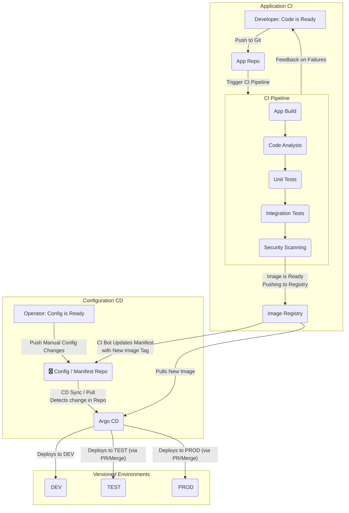

```mermaid
graph TD
    subgraph "Application CI"
        A[Developer: Code is Ready] -->|"Push to Git"| AppRepo(App Repo)
        AppRepo -->|"Trigger CI Pipeline"| GHActions(GitHub Actions)

        subgraph GHActions [CI Pipeline]
            direction LR
            Build(App Build) --> Analysis(Code Analysis) --> Unit(Unit Tests) --> Integration(Integration Tests) --> Security(Security Scanning)
        end

        GHActions -->|"Feedback on Failures"| A
        Security -->|"Image is Ready<br/>Pushing to Registry"| ImageRegistry(Image Registry)
    end

    subgraph "Configuration CD"
        C[Operator: Config is Ready] -->|"Push Manual Config Changes"| ConfigRepo(fa:fa-git-alt Config / Manifest Repo)
        ImageRegistry -->|"CI Bot Updates Manifest<br/>with New Image Tag"| ConfigRepo

        ArgoCD(Argo CD)
        ConfigRepo -->|"CD Sync / Pull<br/>Detects change in Repo"| ArgoCD
        ImageRegistry -->|"Pulls New Image"| ArgoCD
    end

    subgraph "Versioned Environments"
        Dev(fa:fa-kubernetes DEV)
        Test(fa:fa-kubernetes TEST)
        Prod(fa:fa-kubernetes PROD)
    end

    ArgoCD -->|"Deploys to DEV"| Dev
    ArgoCD -->|"Deploys to TEST (via PR/Merge)"| Test
    ArgoCD -->|"Deploys to PROD (via PR/Merge)"| Prod
```
