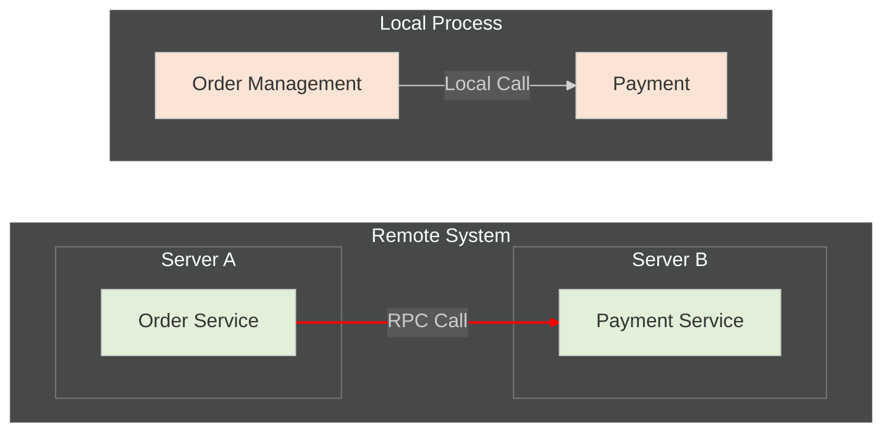
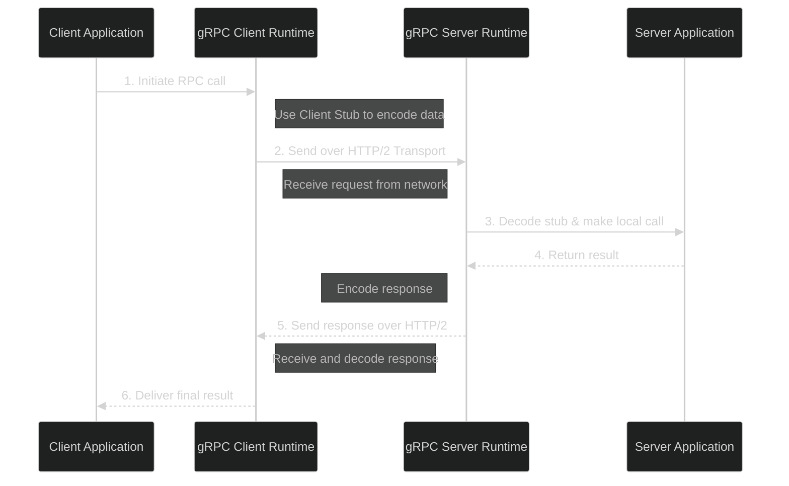
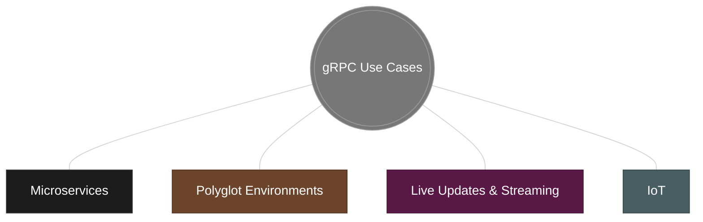
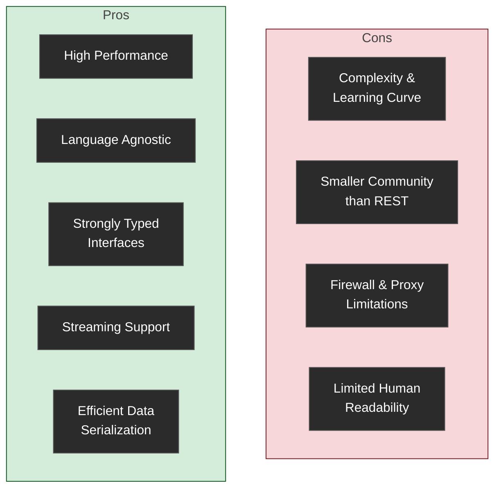

### Local Procedure Call vs. Remote Procedure Call (RPC)

```mermaid
%%{init: {'theme': 'dark'}}%%
graph LR
    %% Define the Remote System on the left
    subgraph "Remote System"
        direction LR
        subgraph Server A
            B1[Order Service]
        end

        subgraph Server B
            C1[Payment Service]
        end
        B1 -- RPC Call --> C1
    end

    %% Define the Local Process on the right
    subgraph "Local Process"
        direction LR
        A1[Order Management] -->|Local Call| A2[Payment]
    end

    %% Style Definitions to match the image colors
    style B1 fill:#e2f0d9,color:#333
    style C1 fill:#e2f0d9,color:#333
    style A1 fill:#fbe4d5,color:#333
    style A2 fill:#fbe4d5,color:#333
    linkStyle 0 stroke:#ff0000,stroke-width:2px;
```

### High-Level gRPC Communication Flow

```mermaid
%%{init: {'theme': 'dark'}}%%
sequenceDiagram
    
    participant ClientApp as Client Application
    participant ClientRuntime as gRPC Client Runtime
    participant ServerRuntime as gRPC Server Runtime
    participant ServerApp as Server Application

    ClientApp->>ClientRuntime: 1. Initiate RPC call
    note right of ClientRuntime: Use Client Stub to encode data
    ClientRuntime->>ServerRuntime: 2. Send over HTTP/2 Transport
    note left of ServerRuntime: Receive request from network
    ServerRuntime->>ServerApp: 3. Decode stub & make local call
    ServerApp-->>ServerRuntime: 4. Return result
    note left of ServerRuntime: Encode response
    ServerRuntime-->>ClientRuntime: 5. Send response over HTTP/2
    note right of ClientRuntime: Receive and decode response
    ClientRuntime-->>ClientApp: 6. Deliver final result
```

### Use Cases for gRPC

```mermaid
%%{init: {'theme': 'dark'}}%%
graph TD
    %% Node Definitions
    A(((gRPC Use Cases)))
    B[Microservices]
    C[Polyglot Environments]
    D[Live Updates & Streaming]
    E[IoT]

    %% Connections from the center
    A --- B
    A --- C
    A --- D
    A --- E

    %% Style Definitions to match the image
    style A fill:#777,stroke:#999,color:#fff
    style B fill:#1C1C1C,stroke:#333,color:#fff
    style C fill:#6b442b,stroke:#553622,color:#fff
    style D fill:#5a1846,stroke:#481338,color:#fff
    style E fill:#495e63,stroke:#3a4b4f,color:#fff
```

### Pros and Cons of gRPC

```mermaid
%%{init: {'theme': 'dark'}}%%
graph TD
    subgraph Cons
        direction LR
        C1["Complexity &<br>Learning Curve"]
        C2["Smaller Community<br>than REST"]
        C3["Firewall & Proxy<br>Limitations"]
        C4["Limited Human<br>Readability"]
    end

    subgraph Pros
        direction LR
        P1["High Performance"]
        P2["Language Agnostic"]
        P3["Strongly Typed<br>Interfaces"]
        P4["Streaming Support"]
        P5["Efficient Data<br>Serialization"]
    end

    %% Style Definitions
    style Cons fill:#f8d7da,stroke:#721c24,color:#444
    style Pros fill:#d4edda,stroke:#155724,color:#444

    classDef innerNode fill:#2b2b2b,stroke:#555,color:#fff
    class P1,P2,P3,P4,P5,C1,C2,C3,C4 innerNode;
```
