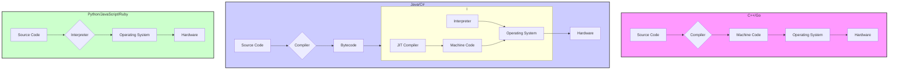

```mermaid
graph TD
    subgraph C++/Go
        A[Source Code] --> B{Compiler};
        B --> C[Machine Code];
        C --> D[Operating System];
        D --> E[Hardware];
    end

    subgraph Java/C#
        F[Source Code] --> G{Compiler};
        G --> H[Bytecode];
        H --> I[Virtual Machine];
        subgraph I
            J[JIT Compiler] --> K[Machine Code];
            L[Interpreter] --> M[Operating System];
        end
        K --> M;
        M --> N[Hardware];
    end

    subgraph Python/JavaScript/Ruby
        O[Source Code] --> P{Interpreter};
        P --> Q[Operating System];
        Q --> R[Hardware];
    end

    style C++/Go fill:#f9f,stroke:#333,stroke-width:2px
    style Java/C# fill:#ccf,stroke:#333,stroke-width:2px
    style Python/JavaScript/Ruby fill:#cfc,stroke:#333,stroke-width:2px
```
