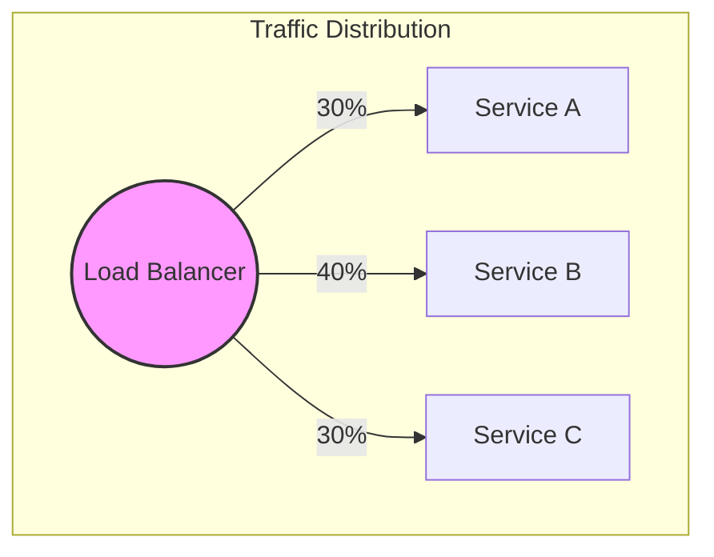
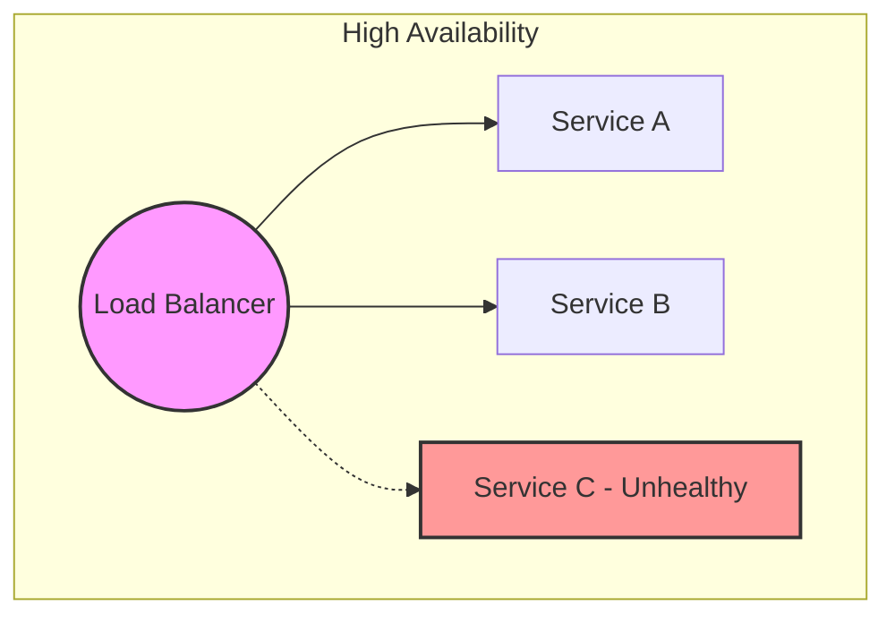
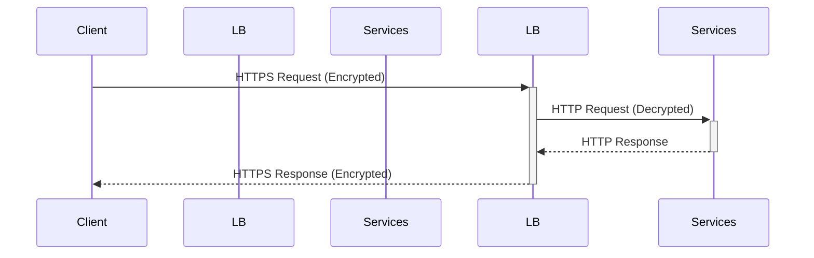
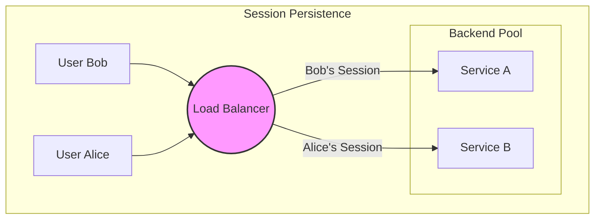
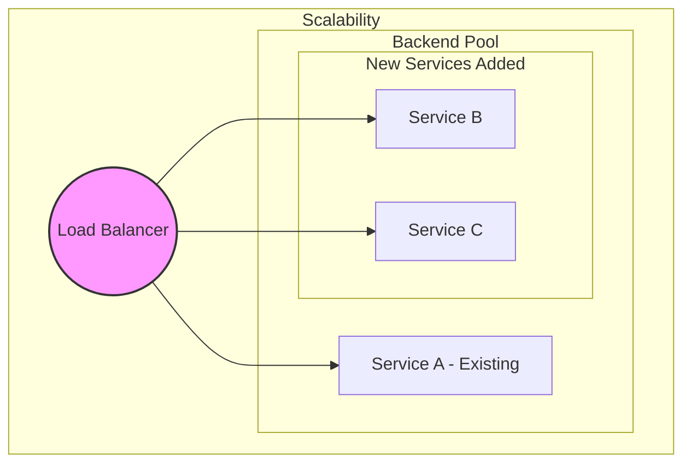
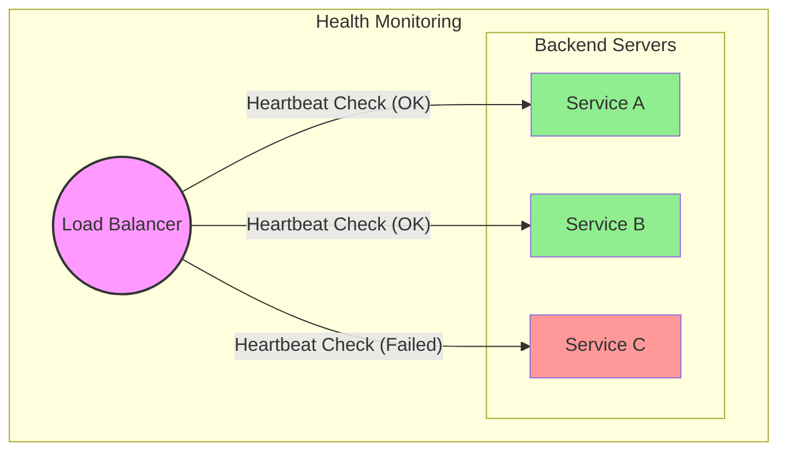

### Traffic Distribution

```mermaid
graph TD
    subgraph "Traffic Distribution"
        LB((Load Balancer))
        LB -- 30% --> ServiceA[Service A]
        LB -- 40% --> ServiceB[Service B]
        LB -- 30% --> ServiceC[Service C]

        style LB fill:#f9f,stroke:#333,stroke-width:2px
    end
```

### High Availability

```mermaid
graph TD
    subgraph "High Availability"
        LB((Load Balancer))
        LB --> ServiceA[Service A]
        LB --> ServiceB[Service B]
        LB -.-> ServiceC[Service C - Unhealthy]

        style ServiceC fill:#ff9999,stroke:#333,stroke-width:2px
        style LB fill:#f9f,stroke:#333,stroke-width:2px
    end
```

### SSL Termination

```mermaid
sequenceDiagram
    participant Client
    participant LoadBalancer as LB
    participant BackendServices as Services

    Client->>+LB: HTTPS Request (Encrypted)
    LB->>+Services: HTTP Request (Decrypted)
    Services-->>-LB: HTTP Response
    LB-->>-Client: HTTPS Response (Encrypted)
```

### Session Persistence

```mermaid
graph TD
    subgraph "Session Persistence"
        UserBob[User Bob] --> LB((Load Balancer))
        UserAlice[User Alice] --> LB

        subgraph "Backend Pool"
            ServiceA[Service A]
            ServiceB[Service B]
        end

        LB -- Bob's Session --> ServiceA
        LB -- Alice's Session --> ServiceB

        style LB fill:#f9f,stroke:#333,stroke-width:2px
    end
```

### 5. Scalability

```mermaid
graph TD
    subgraph "Scalability"
        LB((Load Balancer))

        subgraph "Backend Pool"
            ServiceA[Service A - Existing]
            
            subgraph "New Services Added"
                ServiceB[Service B]
                ServiceC[Service C]
            end
        end

        LB --> ServiceA
        LB --> ServiceB
        LB --> ServiceC
    end

    %% Styling for the Load Balancer
    style LB fill:#f9f,stroke:#333,stroke-width:2px
```

### Health Monitoring

```mermaid
graph TD
    subgraph "Health Monitoring"
        LB((Load Balancer))
        
        subgraph "Backend Servers"
            ServiceA[Service A]
            ServiceB[Service B]
            ServiceC[Service C]
        end

        LB -- "Heartbeat Check (OK)" --> ServiceA
        LB -- "Heartbeat Check (OK)" --> ServiceB
        LB -- "Heartbeat Check (Failed)" --> ServiceC
        
        style ServiceA fill:#90ee90
        style ServiceB fill:#90ee90
        style ServiceC fill:#ff9999
        style LB fill:#f9f,stroke:#333,stroke-width:2px
    end
```
