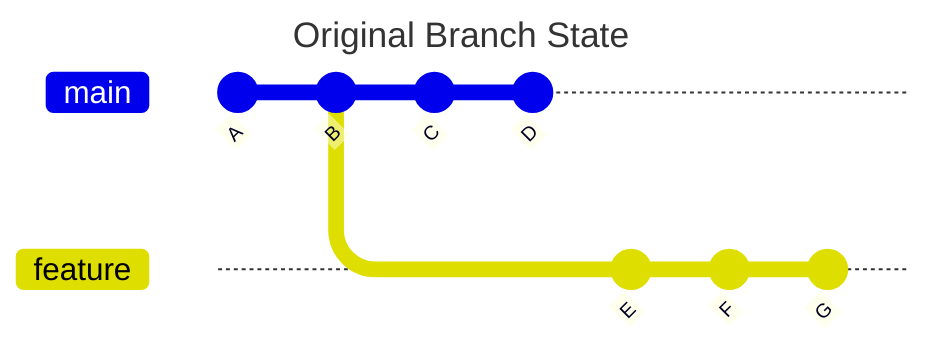
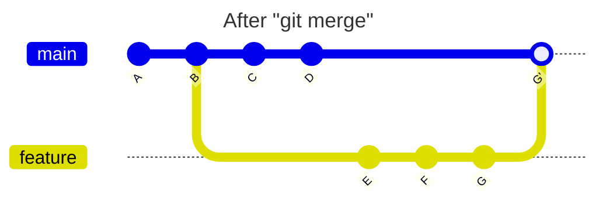
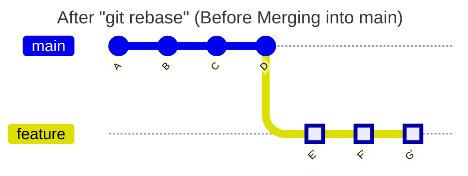
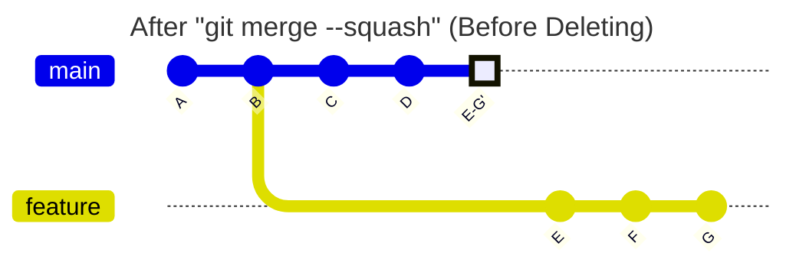

```mermaid
---
title: Original Branch State
---
gitGraph
   commit id: "A"
   commit id: "B"
   branch feature
   checkout main
   commit id: "C"
   commit id: "D"
   checkout feature
   commit id: "E"
   commit id: "F"
   commit id: "G"
```

```mermaid
---
title: After "git merge"
---
gitGraph
   commit id: "A"
   commit id: "B"
   branch feature
   checkout main
   commit id: "C"
   commit id: "D"
   checkout feature
   commit id: "E"
   commit id: "F"
   commit id: "G"
   checkout main
   merge feature id: "G'"
```

```mermaid
---
title: After "git rebase" (Before Merging into main)
---
gitGraph
   commit id: "A"
   commit id: "B"
   commit id: "C"
   commit id: "D"
   branch feature
   checkout feature
   commit id: "E'" type: HIGHLIGHT
   commit id: "F'" type: HIGHLIGHT
   commit id: "G'" type: HIGHLIGHT
   checkout main
```

```mermaid
---
title: After "git merge --squash" (Before Deleting)
---
gitGraph
   commit id: "A"
   commit id: "B"
   branch feature
   checkout main
   commit id: "C"
   commit id: "D"
   commit id: "E-G'" type: HIGHLIGHT
   checkout feature
   commit id: "E"
   commit id: "F"
   commit id: "G"
```

The Golden Rule of Git Rebase: Never use it on public branches!
