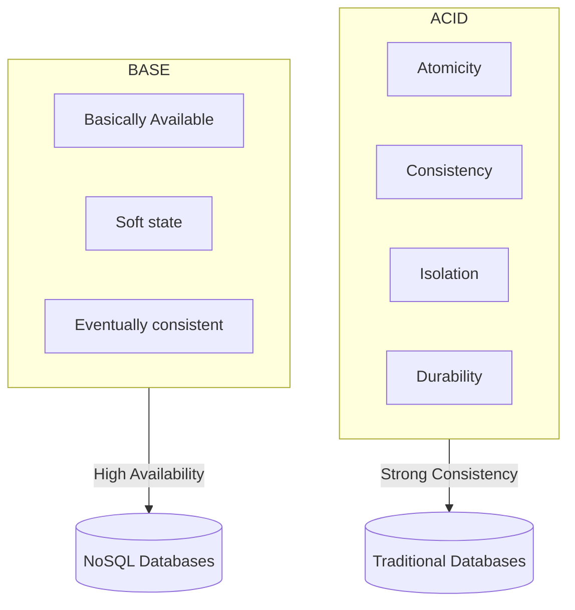

### ACID vs BASE

```mermaid
graph TD;
    subgraph ACID
        A[Atomicity];
        C[Consistency];
        I[Isolation];
        D[Durability];
    end

    subgraph BASE
        BA[Basically Available];
        S[Soft state];
        E[Eventually consistent];
    end

    ACID -- "Strong Consistency" --> DB1[(Traditional Databases)];
    BASE -- "High Availability" --> DB2[(NoSQL Databases)];
```
