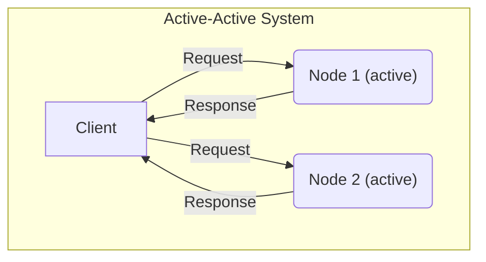
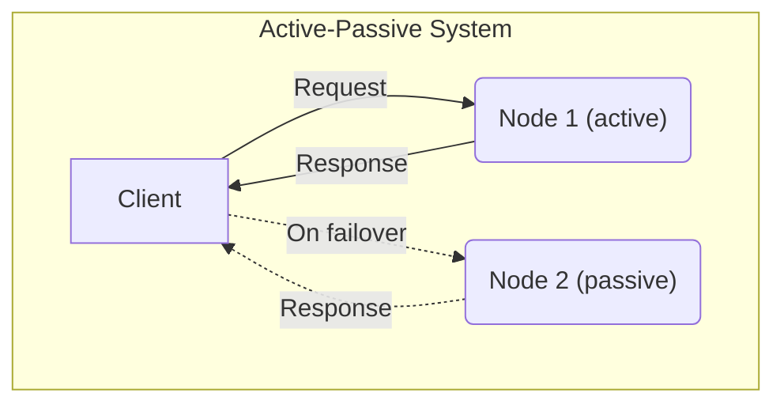

### Active-Active System

```mermaid
graph TD
    subgraph "Active-Active System"
        Client -- Request --> Node1("Node 1 (active)")
        Node1 -- Response --> Client
        
        Client -- Request --> Node2("Node 2 (active)")
        Node2 -- Response --> Client
    end
```

### Active-Passive System

```mermaid
graph TD
    subgraph "Active-Passive System"
        Client -- Request --> Node1("Node 1 (active)")
        Node1 -- Response --> Client

        Client -.->|On failover| Node2("Node 2 (passive)")
        Node2 -.->|Response| Client
    end
```
