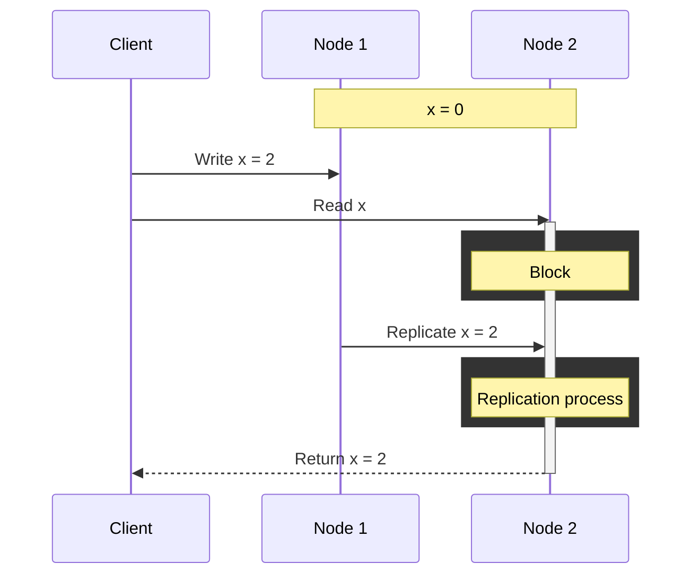
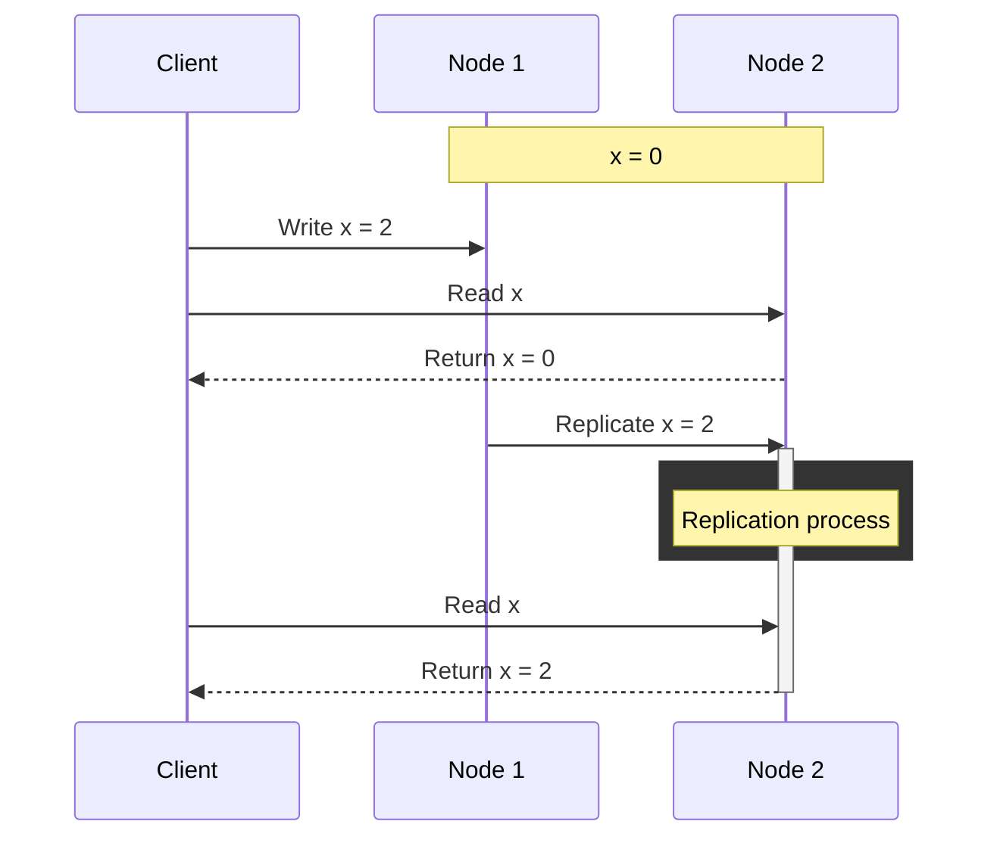

### Strong Consistency

```mermaid
sequenceDiagram
    participant Client
    participant Node 1
    participant Node 2

    Note over Node 1, Node 2: x = 0
    Client->>Node 1: Write x = 2
    Client->>Node 2: Read x
    activate Node 2
    rect
        Note over Node 2: Block
    end
    Node 1->>Node 2: Replicate x = 2
    rect
        Note over Node 2: Replication process
    end
    Node 2-->>Client: Return x = 2
    deactivate Node 2
```

### Eventual Consistency

```mermaid
sequenceDiagram
    participant Client
    participant Node 1
    participant Node 2

    Note over Node 1, Node 2: x = 0
    Client->>Node 1: Write x = 2
    Client->>Node 2: Read x
    Node 2-->>Client: Return x = 0

    Node 1->>Node 2: Replicate x = 2
    activate Node 2
    rect
        Note over Node 2: Replication process
    end
    Client->>Node 2: Read x
    Node 2-->>Client: Return x = 2
    deactivate Node 2
```
