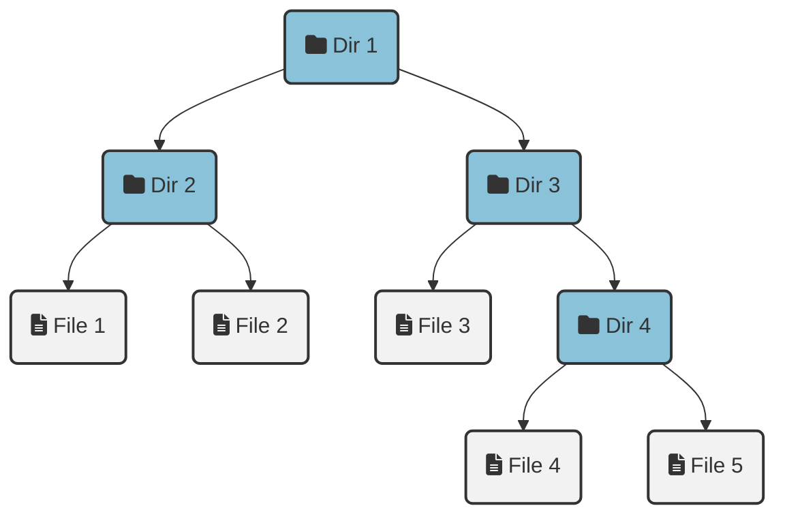
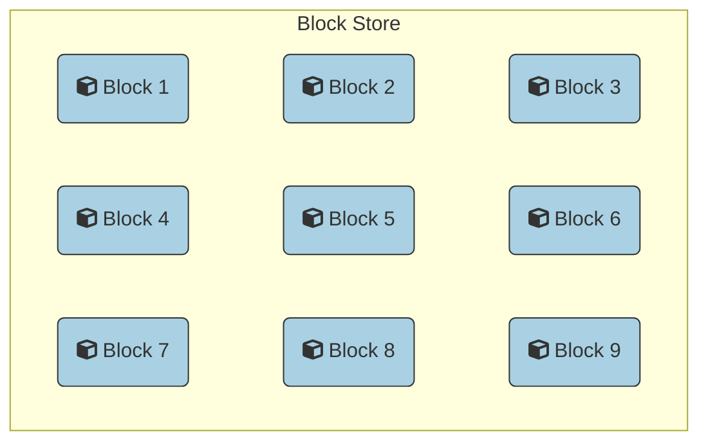
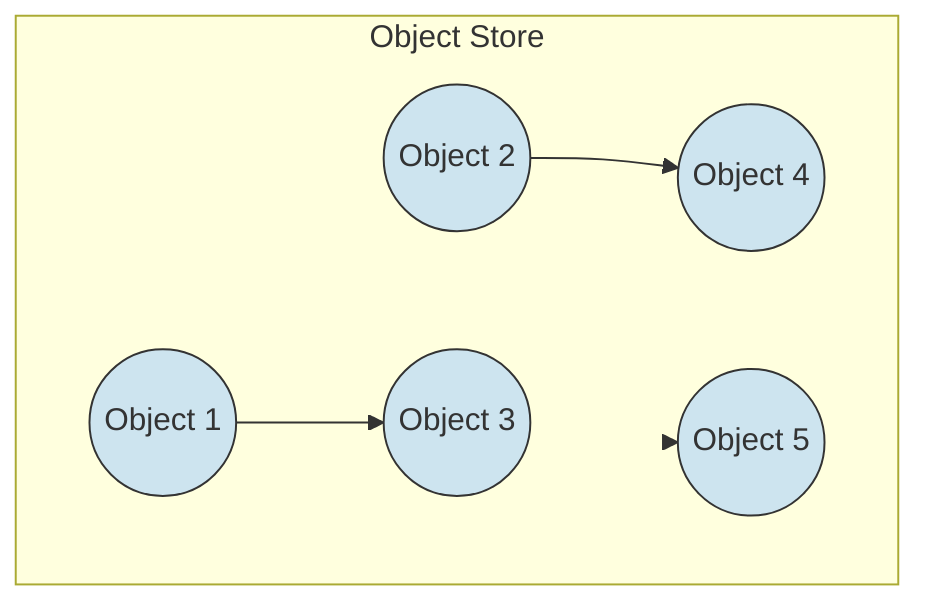

### File Store

```mermaid
graph TD
    %% Define nodes with FontAwesome icons
    Dir1("fa:fa-folder Dir 1")
    Dir2("fa:fa-folder Dir 2")
    Dir3("fa:fa-folder Dir 3")
    Dir4("fa:fa-folder Dir 4")
    File1("fa:fa-file-alt File 1")
    File2("fa:fa-file-alt File 2")
    File3("fa:fa-file-alt File 3")
    File4("fa:fa-file-alt File 4")
    File5("fa:fa-file-alt File 5")

    %% Define connections
    Dir1 --> Dir2
    Dir1 --> Dir3
    Dir2 --> File1
    Dir2 --> File2
    Dir3 --> File3
    Dir3 --> Dir4
    Dir4 --> File4
    Dir4 --> File5

    %% Styling
    style Dir1 fill:#89c2d9,stroke:#333,stroke-width:2px
    style Dir2 fill:#89c2d9,stroke:#333,stroke-width:2px
    style Dir3 fill:#89c2d9,stroke:#333,stroke-width:2px
    style Dir4 fill:#89c2d9,stroke:#333,stroke-width:2px
    style File1 fill:#f2f2f2,stroke:#333,stroke-width:2px
    style File2 fill:#f2f2f2,stroke:#333,stroke-width:2px
    style File3 fill:#f2f2f2,stroke:#333,stroke-width:2px
    style File4 fill:#f2f2f2,stroke:#333,stroke-width:2px
    style File5 fill:#f2f2f2,stroke:#333,stroke-width:2px
```

### Block Store

```mermaid
graph TD
    subgraph "Block Store"
        %% Define each row of blocks on a separate line
        B1("fa:fa-cube Block 1") --- B2("fa:fa-cube Block 2") --- B3("fa:fa-cube Block 3")
        B4("fa:fa-cube Block 4") --- B5("fa:fa-cube Block 5") --- B6("fa:fa-cube Block 6")
        B7("fa:fa-cube Block 7") --- B8("fa:fa-cube Block 8") --- B9("fa:fa-cube Block 9")
    end

    %% --- Styling ---
    %% Style the links to be invisible, completing the grid effect
    linkStyle default stroke-width:0px

    %% Style the blocks
    style B1 fill:#a9d1e3,stroke:#333
    style B2 fill:#a9d1e3,stroke:#333
    style B3 fill:#a9d1e3,stroke:#333
    style B4 fill:#a9d1e3,stroke:#333
    style B5 fill:#a9d1e3,stroke:#333
    style B6 fill:#a9d1e3,stroke:#333
    style B7 fill:#a9d1e3,stroke:#333
    style B8 fill:#a9d1e3,stroke:#333
    style B9 fill:#a9d1e3,stroke:#333
```

### Object Store

```mermaid
graph TD
    subgraph "Object Store"
        %% Define all objects
        O1((Object 1))
        O2((Object 2))
        O3((Object 3))
        O4((Object 4))
        O5((Object 5))

        %% Define the visible relationships
        O1 --> O3
        O2 --> O4
        O3 --> O5

        %% Add an invisible link to align O3 and O4 horizontally
        O3 ~~~ O4
    end

    %% --- Styling ---
    %% Make the alignment link invisible
    linkStyle 2 stroke-width:0px

    %% Style the objects
    style O1 fill:#cde4ef,stroke:#333
    style O2 fill:#cde4ef,stroke:#333
    style O3 fill:#cde4ef,stroke:#333
    style O4 fill:#cde4ef,stroke:#333
    style O5 fill:#cde4ef,stroke:#333
```
