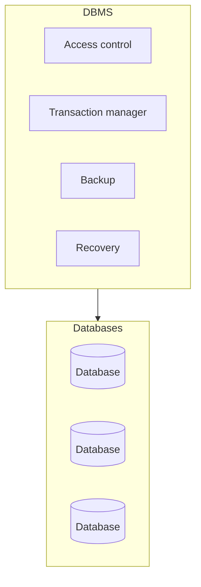

### Database Management System

```mermaid
graph TD
    subgraph DBMS
        A[Access control]
        B[Transaction manager]
        C[Backup]
        D[Recovery]
    end

    subgraph Databases
        db1[(Database)]
        db2[(Database)]
        db3[(Database)]
    end

    DBMS --> Databases
```
