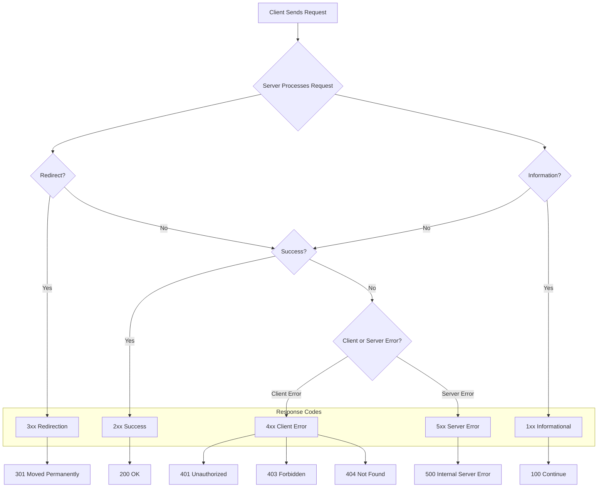

```mermaid
graph TD
  A[Client Sends Request] --> B{Server Processes Request};
    
  B --> H{Redirect?};
  B --> J{Information?};
    
  H --> |Yes| I[3xx Redirection];
  H --> |No| C{Success?};
  
  J --> |Yes| K[1xx Informational];
  J --> |No| C;

  C -->|Yes| D[2xx Success];
  C -->|No| E{Client or Server Error?};
  
  E -->|Client Error| F[4xx Client Error];
  E -->|Server Error| G[5xx Server Error];

  subgraph "Response Codes"
    D;
    F;
    G;
    I;
    K;
  end

  D --> D1[200 OK];
  F --> F1[401 Unauthorized];
  F --> F2[403 Forbidden];
  F --> F3[404 Not Found];
  G --> G1[500 Internal Server Error];
  I --> I1[301 Moved Permanently];
  K --> K1[100 Continue];
```
