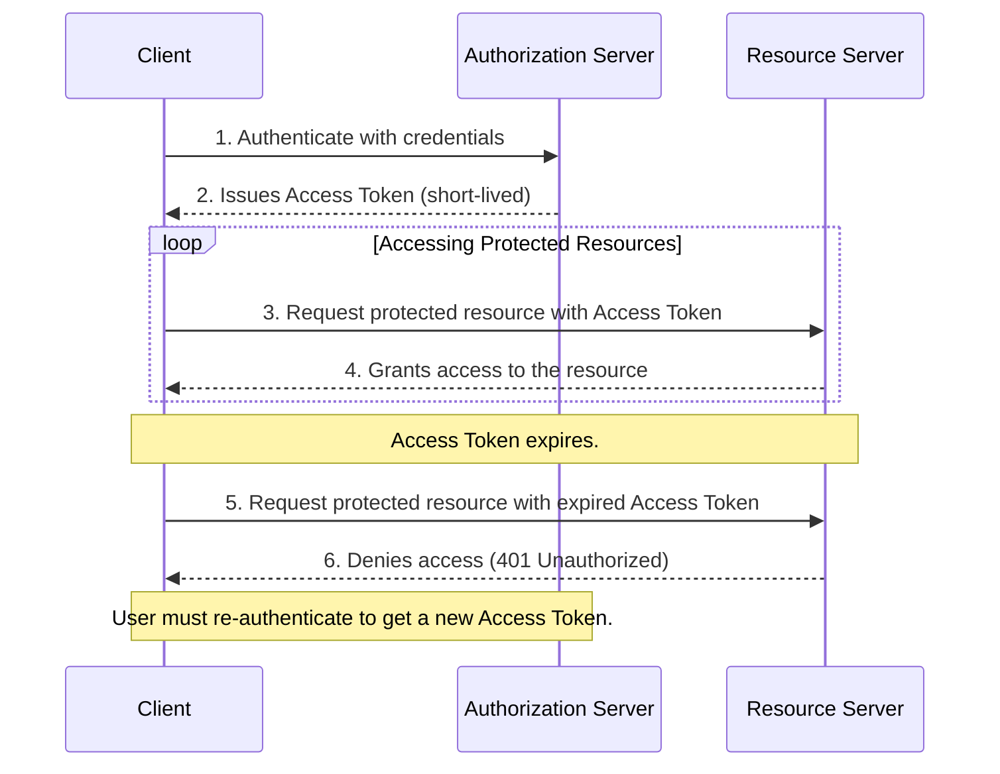
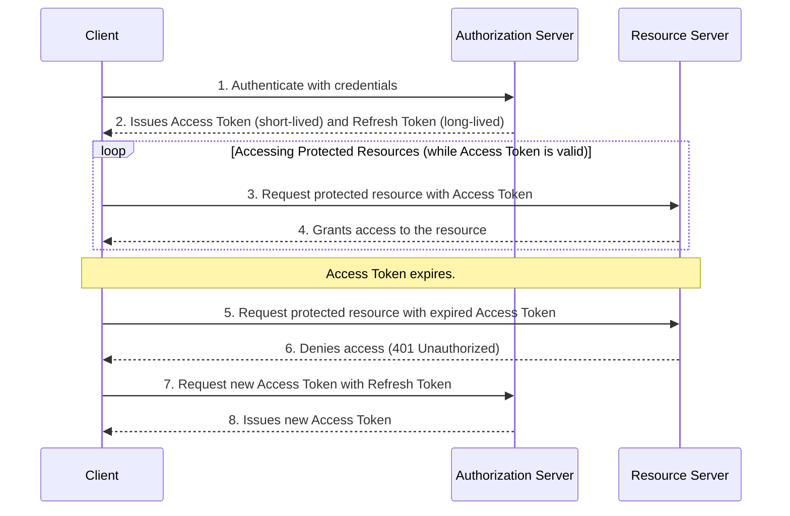
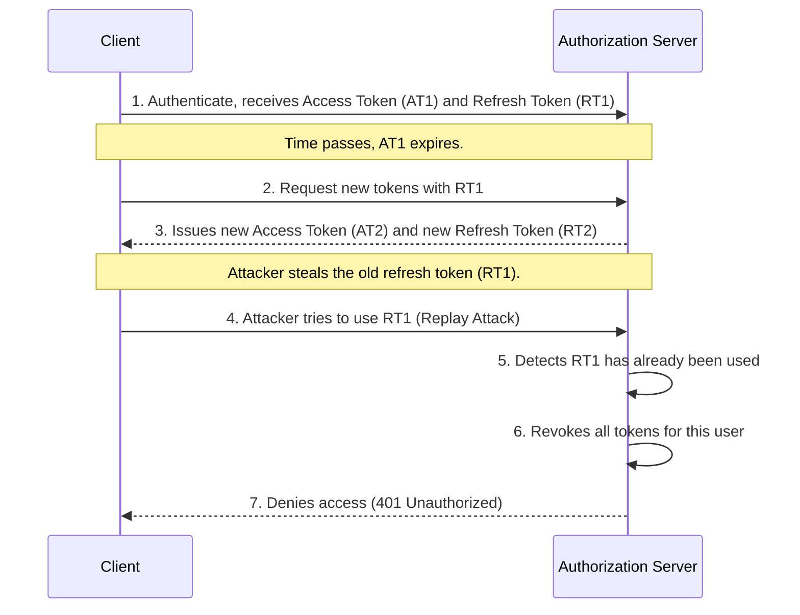
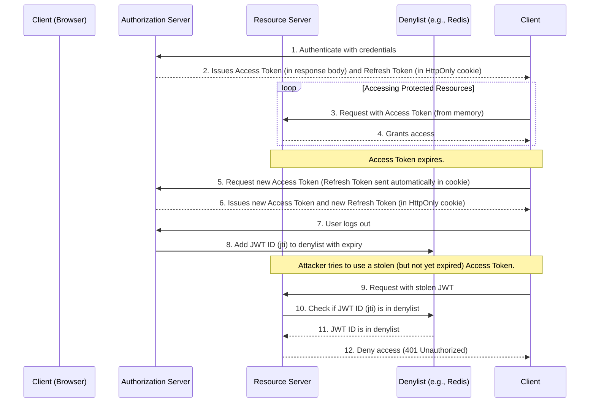

### Basic JWT Access Token Flow

```mermaid
sequenceDiagram
    participant Client
    participant AuthorizationServer as Authorization Server
    participant ResourceServer as Resource Server

    Client->>AuthorizationServer: 1. Authenticate with credentials
    AuthorizationServer-->>Client: 2. Issues Access Token (short-lived)

    loop Accessing Protected Resources
        Client->>ResourceServer: 3. Request protected resource with Access Token
        ResourceServer-->>Client: 4. Grants access to the resource
    end

    Note over Client, ResourceServer: Access Token expires.

    Client->>ResourceServer: 5. Request protected resource with expired Access Token
    ResourceServer-->>Client: 6. Denies access (401 Unauthorized)

    Note over Client, AuthorizationServer: User must re-authenticate to get a new Access Token.
```

### Introducing the Refresh Token

```mermaid
sequenceDiagram
    participant Client
    participant AuthorizationServer as Authorization Server
    participant ResourceServer as Resource Server

    Client->>AuthorizationServer: 1. Authenticate with credentials
    AuthorizationServer-->>Client: 2. Issues Access Token (short-lived) and Refresh Token (long-lived)

    loop Accessing Protected Resources (while Access Token is valid)
        Client->>ResourceServer: 3. Request protected resource with Access Token
        ResourceServer-->>Client: 4. Grants access to the resource
    end

    Note over Client, ResourceServer: Access Token expires.

    Client->>ResourceServer: 5. Request protected resource with expired Access Token
    ResourceServer-->>Client: 6. Denies access (401 Unauthorized)

    Client->>AuthorizationServer: 7. Request new Access Token with Refresh Token
    AuthorizationServer-->>Client: 8. Issues new Access Token
```

### Enhancing Security with Refresh Token Rotation

```mermaid
sequenceDiagram
    participant Client
    participant AuthorizationServer as Authorization Server

    Client->>AuthorizationServer: 1. Authenticate, receives Access Token (AT1) and Refresh Token (RT1)

    Note over Client, AuthorizationServer: Time passes, AT1 expires.

    Client->>AuthorizationServer: 2. Request new tokens with RT1
    AuthorizationServer-->>Client: 3. Issues new Access Token (AT2) and new Refresh Token (RT2)

    Note over Client, AuthorizationServer: Attacker steals the old refresh token (RT1).

    Client->>AuthorizationServer: 4. Attacker tries to use RT1 (Replay Attack)
    AuthorizationServer->>AuthorizationServer: 5. Detects RT1 has already been used
    AuthorizationServer->>AuthorizationServer: 6. Revokes all tokens for this user
    AuthorizationServer-->>Client: 7. Denies access (401 Unauthorized)
```

### Comprehensive JWT Flow with Secure Storage and Denylist

```mermaid
sequenceDiagram
    participant Client (Browser)
    participant AuthorizationServer as Authorization Server
    participant ResourceServer as Resource Server
    participant DenylistCache as Denylist (e.g., Redis)

    Client->>AuthorizationServer: 1. Authenticate with credentials
    AuthorizationServer-->>Client: 2. Issues Access Token (in response body) and Refresh Token (in HttpOnly cookie)

    loop Accessing Protected Resources
        Client->>ResourceServer: 3. Request with Access Token (from memory)
        ResourceServer-->>Client: 4. Grants access
    end

    Note over Client, ResourceServer: Access Token expires.

    Client->>AuthorizationServer: 5. Request new Access Token (Refresh Token sent automatically in cookie)
    AuthorizationServer-->>Client: 6. Issues new Access Token and new Refresh Token (in HttpOnly cookie)

    Client->>AuthorizationServer: 7. User logs out
    AuthorizationServer->>DenylistCache: 8. Add JWT ID (jti) to denylist with expiry

    Note over Client, ResourceServer: Attacker tries to use a stolen (but not yet expired) Access Token.

    Client->>ResourceServer: 9. Request with stolen JWT
    ResourceServer->>DenylistCache: 10. Check if JWT ID (jti) is in denylist
    DenylistCache-->>ResourceServer: 11. JWT ID is in denylist
    ResourceServer-->>Client: 12. Deny access (401 Unauthorized)
```
