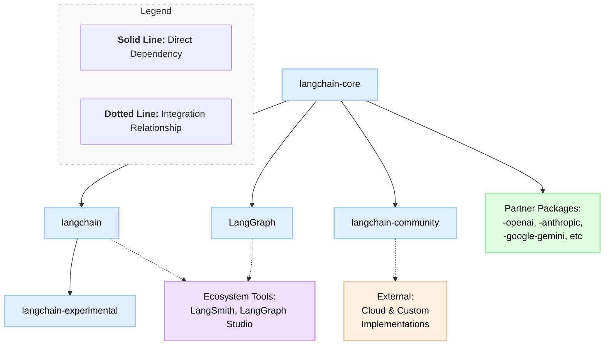

```mermaid
graph TD
    %% Main Diagram Node Definitions
    core["langchain-core"]
    langchain["langchain"]
    experimental["langchain-experimental"]
    community["langchain-community"]
    langgraph["LangGraph"]
    tools["Ecosystem Tools:<br/>LangSmith, LangGraph Studio"]
    external["External:<br/>Cloud & Custom<br/>Implementations"]
    partners["Partner Packages:<br/>-openai, -anthropic,<br/>-google-gemini, etc"]

    %% Core Dependencies (Solid Lines)
    core --> langchain
    core --> community
    core --> langgraph
    core --> partners
    langchain --> experimental
    
    %% Integration Relationships (Dotted Lines)
    community -.-> external
    langchain -.-> tools
    langgraph -.-> tools
    
    %% Compact and Corrected Legend
    subgraph Legend
        L1["<b>Solid Line:</b> Direct Dependency"]
        L2["<b>Dotted Line:</b> Integration Relationship"]
    end

    %% Styling for Nodes
    classDef blue fill:#e0f0ff,stroke:#a0c8f0,stroke-width:2px,color:black;
    classDef purple fill:#f0e0ff,stroke:#c8a0f0,stroke-width:2px,color:black;
    classDef orange fill:#fff0e0,stroke:#f0c8a0,stroke-width:2px,color:black;
    classDef green fill:#e0ffe0,stroke:#a0f0a0,stroke-width:2px,color:black;

    class core,langchain,experimental,community,langgraph blue;
    class tools purple;
    class external orange;
    class partners green;
    
    %% Styling for the Legend Box
    style Legend fill:#f9f9f9,stroke:#ccc,stroke-width:1px,stroke-dasharray: 5 5
```
