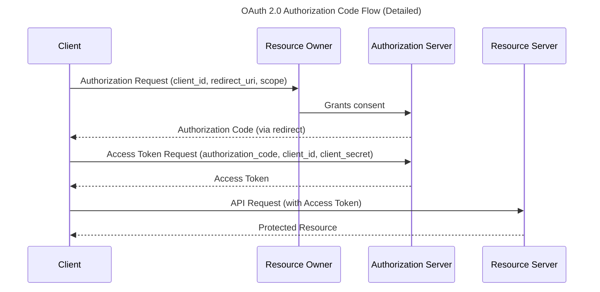
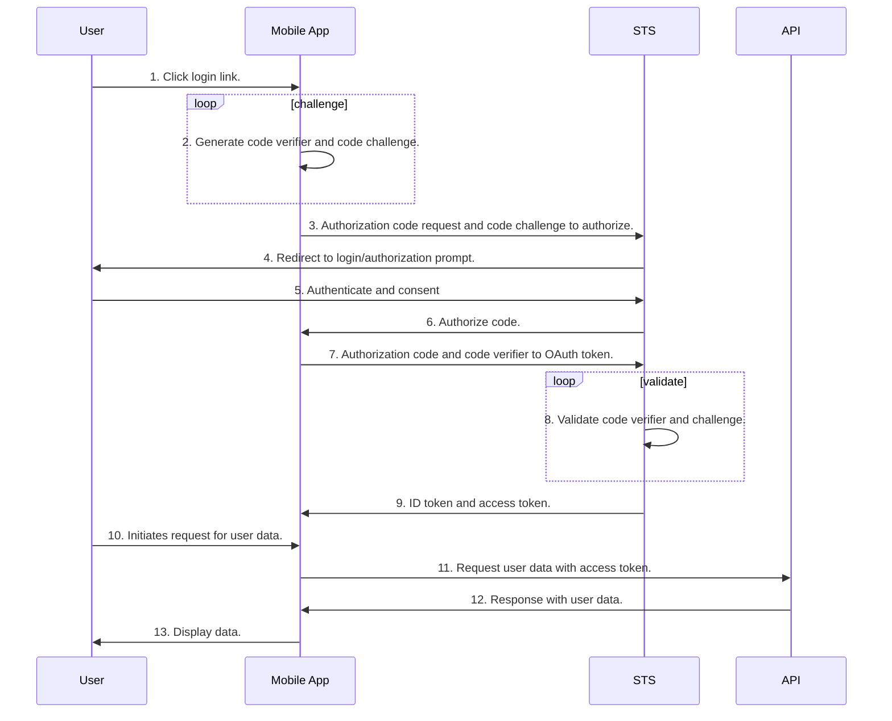
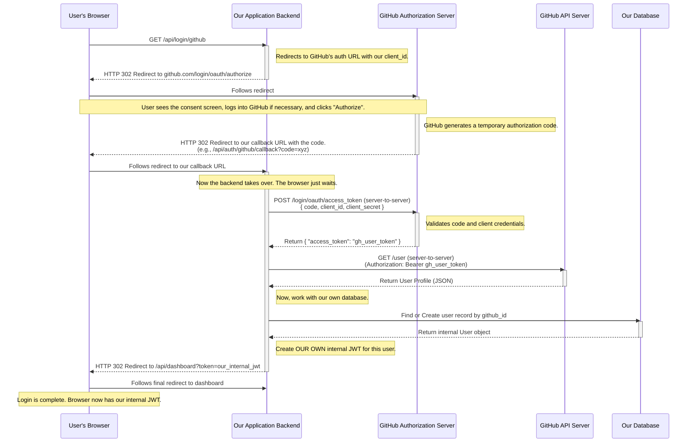
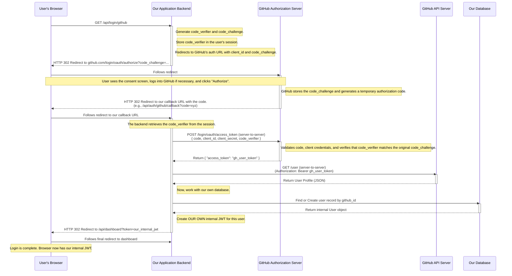

### Basic OAuth 2.0 Flow

```mermaid
sequenceDiagram
    title OAuth 2.0 Authorization Code Flow (Detailed)
    participant C as Client
    participant O as Resource Owner
    participant A as Authorization Server
    participant R as Resource Server

    C->>O: Authorization Request (client_id, redirect_uri, scope)
    O->>A: Grants consent
    A-->>C: Authorization Code (via redirect)
    C->>A: Access Token Request (authorization_code, client_id, client_secret)
    A-->>C: Access Token
    C->>R: API Request (with Access Token)
    R-->>C: Protected Resource
```

### OAuth 2.0 with PKCE (Proof Key for Code Exchange)

```mermaid
sequenceDiagram
    participant User
    participant Mobile App
    participant STS
    participant API

    %% --- Steps 1-8 are the same ---
    User->>Mobile App: 1. Click login link.
    loop challenge
        Mobile App->>Mobile App: 2. Generate code verifier and code challenge.
    end
    Mobile App->>STS: 3. Authorization code request and code challenge to authorize.
    STS->>User: 4. Redirect to login/authorization prompt.
    User->>STS: 5. Authenticate and consent
    STS->>Mobile App: 6. Authorize code.
    Mobile App->>STS: 7. Authorization code and code verifier to OAuth token.
    loop validate
        STS->>STS: 8. Validate code verifier and challenge.
    end

    %% --- Refined Steps 9-12 ---
    STS->>Mobile App: 9. ID token and access token.
    User->>Mobile App: 10. Initiates request for user data.
    Mobile App->>API: 11. Request user data with access token.
    API->>Mobile App: 12. Response with user data.
    Mobile App->>User: 13. Display data.
```

### Basic OAuth 2.0 Flow with GitHub

```mermaid
sequenceDiagram
    participant User's Browser
    participant Our Application Backend
    participant GitHub Authorization Server
    participant GitHub API Server
    participant Our Database

    %% === Phase 1: User initiates login and is redirected ===

    User's Browser->>Our Application Backend: GET /api/login/github
    activate Our Application Backend
    note right of Our Application Backend: Redirects to GitHub's auth URL with our client_id.
    Our Application Backend-->>User's Browser: HTTP 302 Redirect to github.com/login/oauth/authorize
    deactivate Our Application Backend

    %% === Phase 2: User authorizes the application on GitHub ===

    User's Browser->>GitHub Authorization Server: Follows redirect
    activate GitHub Authorization Server
    note over User's Browser, GitHub Authorization Server: User sees the consent screen, logs into GitHub if necessary, and clicks "Authorize".
    note right of GitHub Authorization Server: GitHub generates a temporary authorization code.
    GitHub Authorization Server-->>User's Browser: HTTP 302 Redirect to our callback URL with the code.<br/>(e.g., /api/auth/github/callback?code=xyz)
    deactivate GitHub Authorization Server

    %% === Phase 3: Backend exchanges the code for an access token ===

    User's Browser->>Our Application Backend: Follows redirect to our callback URL
    activate Our Application Backend
    note over Our Application Backend: Now the backend takes over. The browser just waits.
    Our Application Backend->>GitHub Authorization Server: POST /login/oauth/access_token (server-to-server)<br/>{ code, client_id, client_secret }
    activate GitHub Authorization Server
    note right of GitHub Authorization Server: Validates code and client credentials.
    GitHub Authorization Server-->>Our Application Backend: Return { "access_token": "gh_user_token" }
    deactivate GitHub Authorization Server

    %% === Phase 4: Backend fetches user info and creates internal session ===

    Our Application Backend->>GitHub API Server: GET /user (server-to-server)<br/>(Authorization: Bearer gh_user_token)
    activate GitHub API Server
    GitHub API Server-->>Our Application Backend: Return User Profile (JSON)
    deactivate GitHub API Server

    note right of Our Application Backend: Now, work with our own database.
    Our Application Backend->>Our Database: Find or Create user record by github_id
    activate Our Database
    Our Database-->>Our Application Backend: Return internal User object
    deactivate Our Database

    note right of Our Application Backend: Create OUR OWN internal JWT for this user.
    
    Our Application Backend-->>User's Browser: HTTP 302 Redirect to /api/dashboard?token=our_internal_jwt
    deactivate Our Application Backend
    
    User's Browser->>Our Application Backend: Follows final redirect to dashboard
    Note over User's Browser: Login is complete. Browser now has our internal JWT.
```

### OAuth 2.0 Flow with PKCE with GitHub

```mermaid
sequenceDiagram
    participant User's Browser
    participant Our Application Backend
    participant GitHub Authorization Server
    participant GitHub API Server
    participant Our Database

    %% === Phase 1: User initiates login, PKCE verifier/challenge are created ===

    User's Browser->>Our Application Backend: GET /api/login/github
    activate Our Application Backend
    note right of Our Application Backend: Generate code_verifier and code_challenge.
    note right of Our Application Backend: Store code_verifier in the user's session.
    note right of Our Application Backend: Redirects to GitHub's auth URL with client_id and code_challenge.
    Our Application Backend-->>User's Browser: HTTP 302 Redirect to github.com/login/oauth/authorize?code_challenge=...
    deactivate Our Application Backend

    %% === Phase 2: User authorizes the application on GitHub ===

    User's Browser->>GitHub Authorization Server: Follows redirect
    activate GitHub Authorization Server
    note over User's Browser, GitHub Authorization Server: User sees the consent screen, logs into GitHub if necessary, and clicks "Authorize".
    note right of GitHub Authorization Server: GitHub stores the code_challenge and generates a temporary authorization code.
    GitHub Authorization Server-->>User's Browser: HTTP 302 Redirect to our callback URL with the code.<br/>(e.g., /api/auth/github/callback?code=xyz)
    deactivate GitHub Authorization Server

    %% === Phase 3: Backend exchanges the code and verifier for an access token ===

    User's Browser->>Our Application Backend: Follows redirect to our callback URL
    activate Our Application Backend
    note over Our Application Backend: The backend retrieves the code_verifier from the session.
    Our Application Backend->>GitHub Authorization Server: POST /login/oauth/access_token (server-to-server)<br/>{ code, client_id, client_secret, code_verifier }
    activate GitHub Authorization Server
    note right of GitHub Authorization Server: Validates code, client credentials, and verifies that code_verifier matches the original code_challenge.
    GitHub Authorization Server-->>Our Application Backend: Return { "access_token": "gh_user_token" }
    deactivate GitHub Authorization Server

    %% === Phase 4: Backend fetches user info and creates internal session ===

    Our Application Backend->>GitHub API Server: GET /user (server-to-server)<br/>(Authorization: Bearer gh_user_token)
    activate GitHub API Server
    GitHub API Server-->>Our Application Backend: Return User Profile (JSON)
    deactivate GitHub API Server

    note right of Our Application Backend: Now, work with our own database.
    Our Application Backend->>Our Database: Find or Create user record by github_id
    activate Our Database
    Our Database-->>Our Application Backend: Return internal User object
    deactivate Our Database

    note right of Our Application Backend: Create OUR OWN internal JWT for this user.
    
    Our Application Backend-->>User's Browser: HTTP 302 Redirect to /api/dashboard?token=our_internal_jwt
    deactivate Our Application Backend
    
    User's Browser->>Our Application Backend: Follows final redirect to dashboard
    Note over User's Browser: Login is complete. Browser now has our internal JWT.
```
