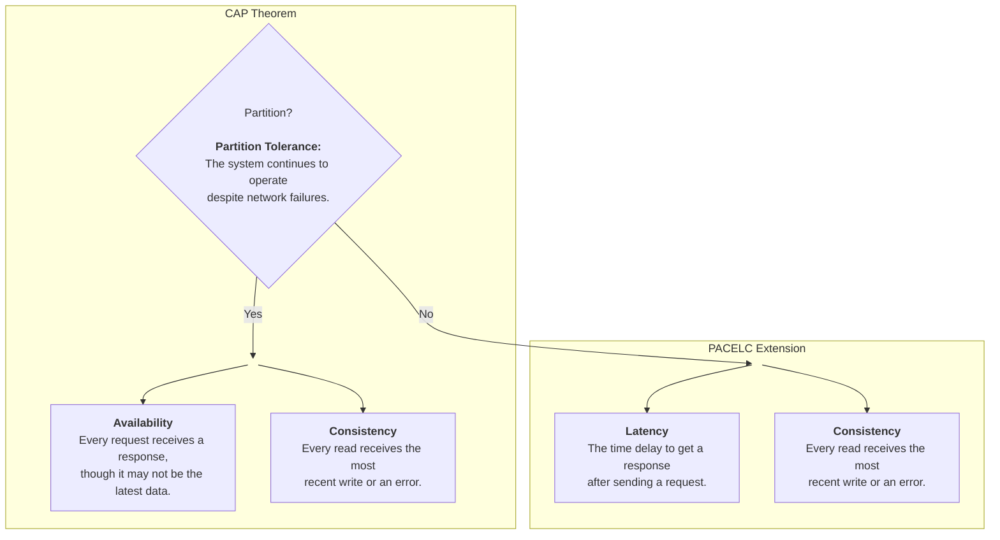

### PACELC Theorem

```mermaid
graph TD
    subgraph CAP Theorem
        direction TB
        A{"Partition?<br/><br/><b>Partition Tolerance:</b><br/>The system continues to operate<br/>despite network failures."}
        A -- Yes --> B(( ))
        B --> B1["<b>Availability</b><br/>Every request receives a response,<br/>though it may not be the latest data."]
        B --> B2["<b>Consistency</b><br/>Every read receives the most<br/>recent write or an error."]
    end

    subgraph PACELC Extension
        direction TB
        C(( ))
        C --> C1["<b>Latency</b><br/>The time delay to get a response<br/>after sending a request."]
        C --> C2["<b>Consistency</b><br/>Every read receives the most<br/>recent write or an error."]
    end

    A -- No --> C

    %% Style the fork points to be invisible
    style B fill:none,stroke:none
    style C fill:none,stroke:none
```
