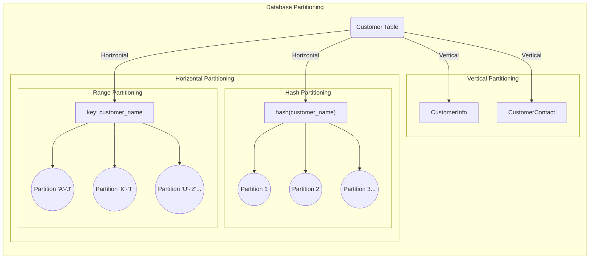

```mermaid
graph TD
    subgraph "Database Partitioning"
        direction TB
        A(Customer Table)

        subgraph "Vertical Partitioning"
            direction LR
            B[CustomerInfo]
            C[CustomerContact]
        end

        subgraph "Horizontal Partitioning"
            direction TB
            subgraph "Hash Partitioning"
                E["hash(customer_name)"]
                F((Partition 1))
                G((Partition 2))
                H((Partition 3...))
            end
            subgraph "Range Partitioning"
                I[key: customer_name]
                J((Partition 'A'-'J'))
                K((Partition 'K'-'T'))
                L((Partition 'U'-'Z'...))
            end
        end


    A -- Vertical --> B
    A -- Vertical --> C

    A -- Horizontal --> E
    A -- Horizontal --> I


    E --> F
    E --> G
    E --> H

    I --> J
    I --> K
    I --> L
    end
```
