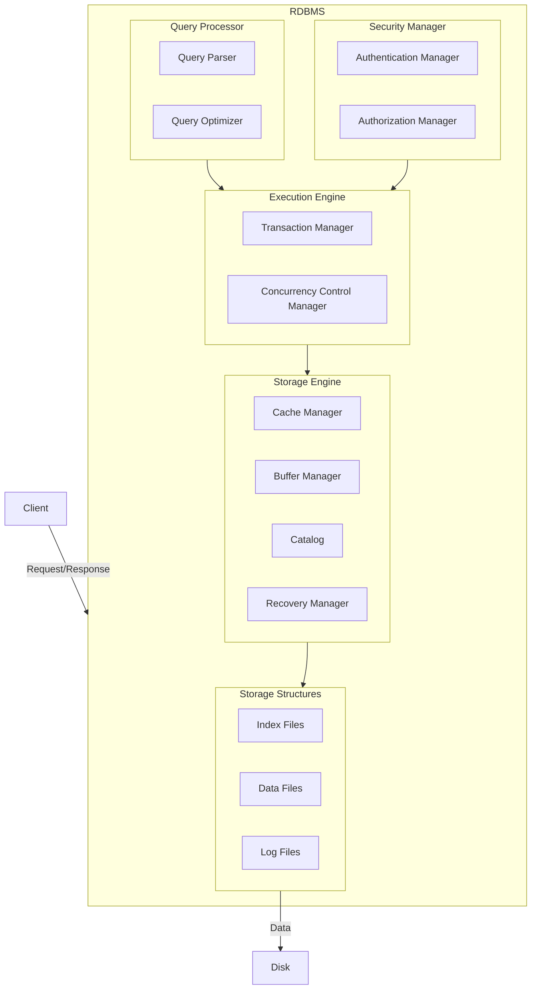

### Relational Database Management System Architecture

```mermaid
graph TD
    Client -- "Request/Response" --> RDBMS;

    subgraph RDBMS [RDBMS]
        subgraph QueryProcessor [Query Processor]
            QueryParser[Query Parser]
            QueryOptimizer[Query Optimizer]
        end

        subgraph SecurityManager [Security Manager]
            AuthenticationManager[Authentication Manager]
            AuthorizationManager[Authorization Manager]
        end

        subgraph ExecutionEngine [Execution Engine]
            TransactionManager[Transaction Manager]
            ConcurrencyControlManager[Concurrency Control Manager]
        end

        subgraph StorageEngine [Storage Engine]
            CacheManager[Cache Manager]
            BufferManager[Buffer Manager]
            Catalog[Catalog]
            RecoveryManager[Recovery Manager]
        end
        
        subgraph StorageStructures [Storage Structures]
            IndexFiles[Index Files]
            DataFiles[Data Files]
            LogFiles[Log Files]
        end

        QueryProcessor --> ExecutionEngine;
        SecurityManager --> ExecutionEngine;
        ExecutionEngine --> StorageEngine;
        StorageEngine --> StorageStructures;
    end

    StorageStructures -- "Data" --> Disk;
```
