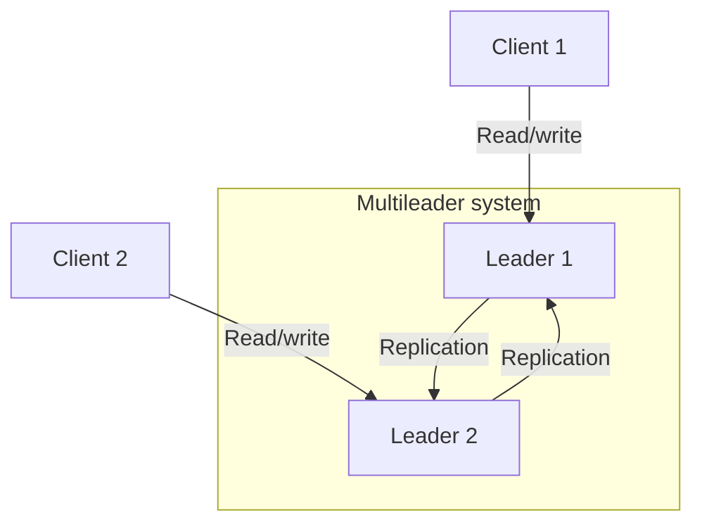
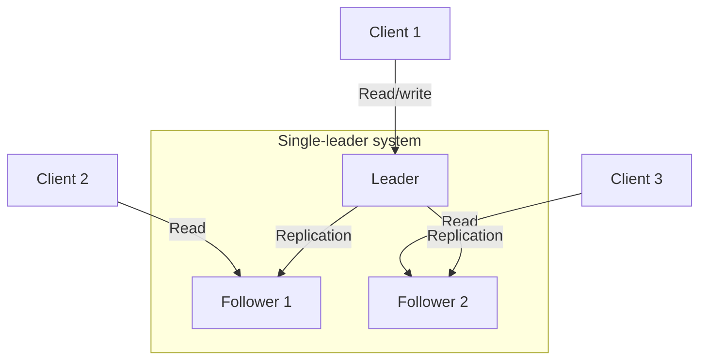

### Multileader Replication

```mermaid
graph TD
    subgraph Multileader system
        L1[Leader 1]
        L2[Leader 2]
    end

    C1[Client 1] -- Read/write --> L1
    C2[Client 2] -- Read/write --> L2
    L1 -- Replication --> L2
    L2 -- Replication --> L1
```

### Single-leader Replication

```mermaid
graph TD
    subgraph Single-leader system
        Leader
        Follower1[Follower 1]
        Follower2[Follower 2]
    end

    C1[Client 1] -- Read/write --> Leader
    C2[Client 2] -- Read --> Follower1
    C3[Client 3] -- Read --> Follower2
    Leader -- Replication --> Follower1
    Leader -- Replication --> Follower2
```
