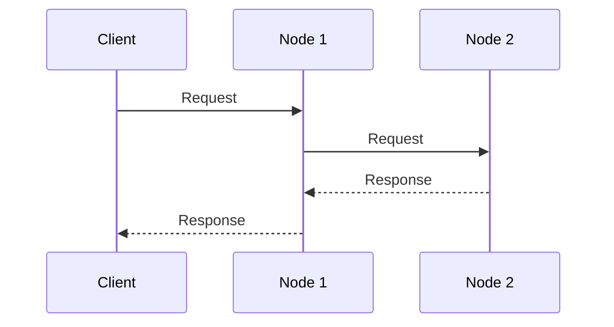
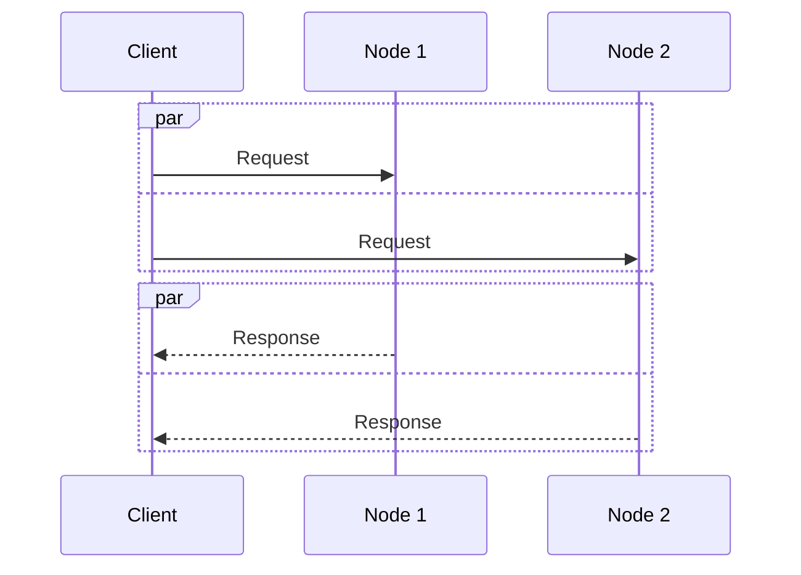

### Sequential System

```mermaid
sequenceDiagram
    participant Client
    participant Node 1
    participant Node 2

    Client->>Node 1: Request
    Node 1->>Node 2: Request
    Node 2-->>Node 1: Response
    Node 1-->>Client: Response
```

### Parallel System

```mermaid
sequenceDiagram
    participant Client
    participant Node 1
    participant Node 2

    par
        Client->>Node 1: Request
    and
        Client->>Node 2: Request
    end

    par
        Node 1-->>Client: Response
    and
        Node 2-->>Client: Response
    end
```
