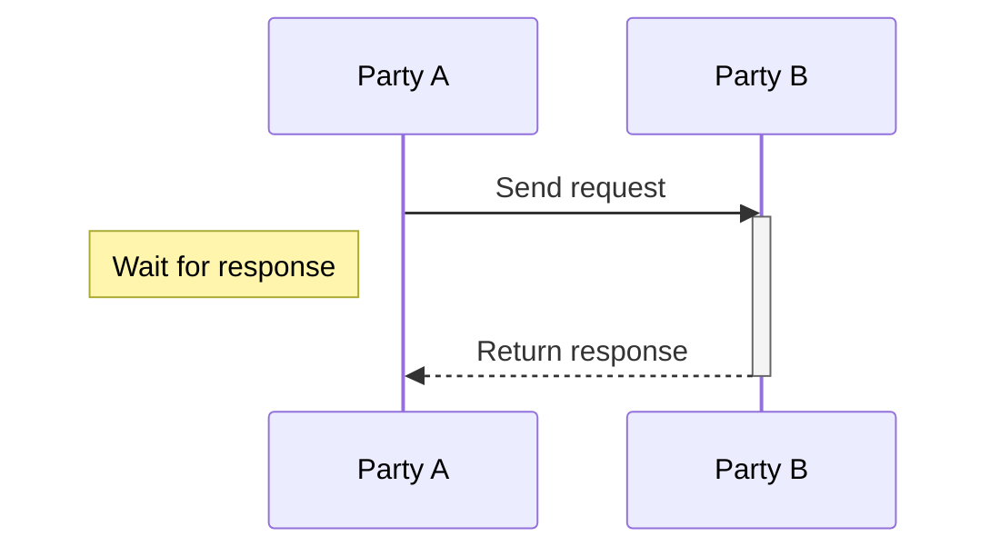
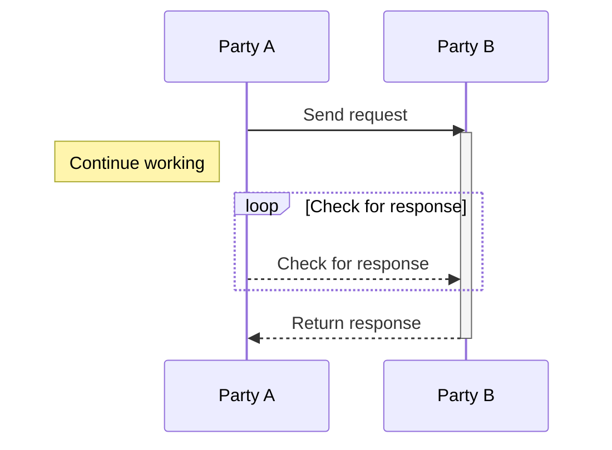
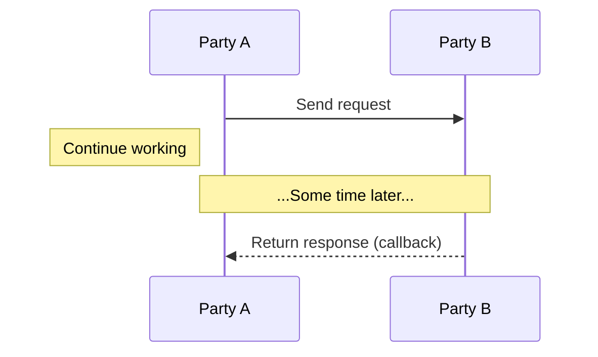

### Synchronous Communication

```mermaid
sequenceDiagram
    participant Party A
    participant Party B

    Party A->>Party B: Send request
    activate Party B
    Note left of Party A: Wait for response
    Party B-->>Party A: Return response
    deactivate Party B
```

### Asynchronous Communication (Polling)

```mermaid
sequenceDiagram
    participant Party A
    participant Party B

    Party A->>Party B: Send request
    activate Party B
    Note left of Party A: Continue working
    
    loop Check for response
        Party A-->>Party B: Check for response
    end
    
    Party B-->>Party A: Return response
    deactivate Party B
```

### Asynchronous Communication (Callback)

```mermaid
sequenceDiagram
    participant Party A
    participant Party B

    Party A->>Party B: Send request
    Note left of Party A: Continue working
    
    Note over Party A, Party B: ...Some time later...
    
    Party B-->>Party A: Return response (callback)
```
