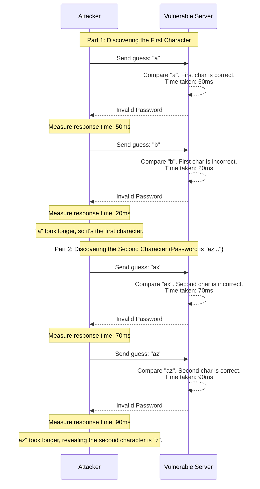
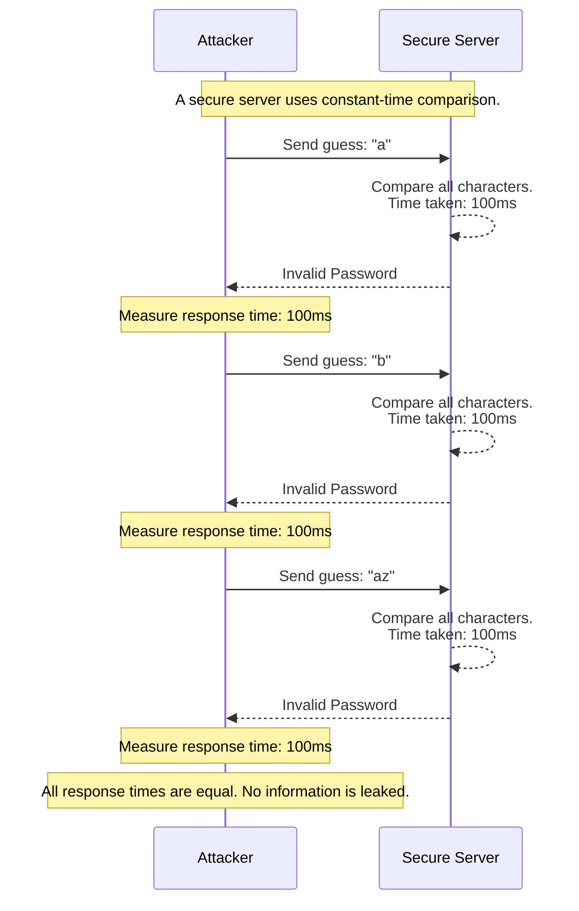

### Timing Attack

```mermaid
sequenceDiagram
    participant Attacker
    participant Vulnerable Server

    Note over Attacker, Vulnerable Server: Part 1: Discovering the First Character

    Attacker->>Vulnerable Server: Send guess: "a"
    Vulnerable Server-->>Vulnerable Server: Compare "a". First char is correct.<br>Time taken: 50ms
    Vulnerable Server-->>Attacker: Invalid Password
    Note over Attacker: Measure response time: 50ms

    Attacker->>Vulnerable Server: Send guess: "b"
    Vulnerable Server-->>Vulnerable Server: Compare "b". First char is incorrect.<br>Time taken: 20ms
    Vulnerable Server-->>Attacker: Invalid Password
    Note over Attacker: Measure response time: 20ms

    Note over Attacker: "a" took longer, so it's the first character.

    Note over Attacker, Vulnerable Server: Part 2: Discovering the Second Character (Password is "az...")

    Attacker->>Vulnerable Server: Send guess: "ax"
    Vulnerable Server-->>Vulnerable Server: Compare "ax". Second char is incorrect.<br>Time taken: 70ms
    Vulnerable Server-->>Attacker: Invalid Password
    Note over Attacker: Measure response time: 70ms

    Attacker->>Vulnerable Server: Send guess: "az"
    Vulnerable Server-->>Vulnerable Server: Compare "az". Second char is correct.<br>Time taken: 90ms
    Vulnerable Server-->>Attacker: Invalid Password
    Note over Attacker: Measure response time: 90ms

    Note over Attacker: "az" took longer, revealing the second character is "z".
```

### Mitigation

```mermaid
sequenceDiagram
    participant Attacker
    participant Secure Server

    Note over Attacker, Secure Server: A secure server uses constant-time comparison.

    Attacker->>Secure Server: Send guess: "a"
    Secure Server-->>Secure Server: Compare all characters.<br>Time taken: 100ms
    Secure Server-->>Attacker: Invalid Password
    Note over Attacker: Measure response time: 100ms

    Attacker->>Secure Server: Send guess: "b"
    Secure Server-->>Secure Server: Compare all characters.<br>Time taken: 100ms
    Secure Server-->>Attacker: Invalid Password
    Note over Attacker: Measure response time: 100ms

    Attacker->>Secure Server: Send guess: "az"
    Secure Server-->>Secure Server: Compare all characters.<br>Time taken: 100ms
    Secure Server-->>Attacker: Invalid Password
    Note over Attacker: Measure response time: 100ms

    Note over Attacker: All response times are equal. No information is leaked.
```
