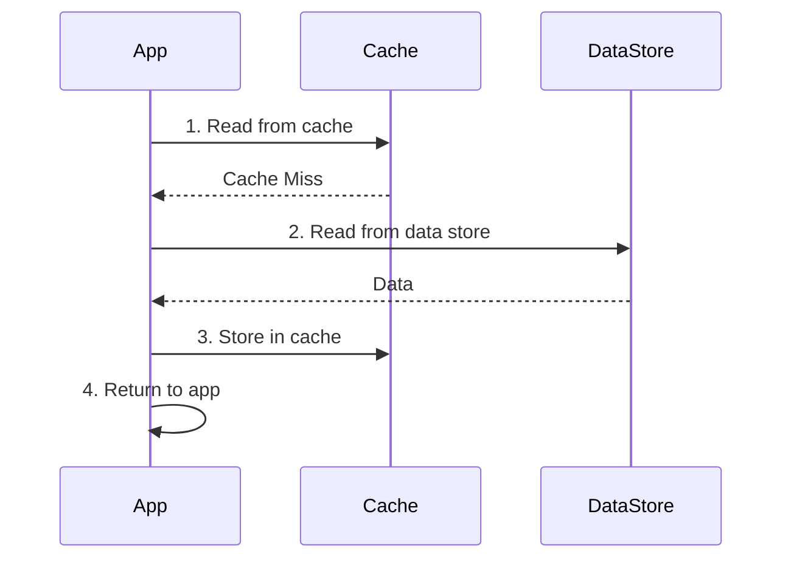
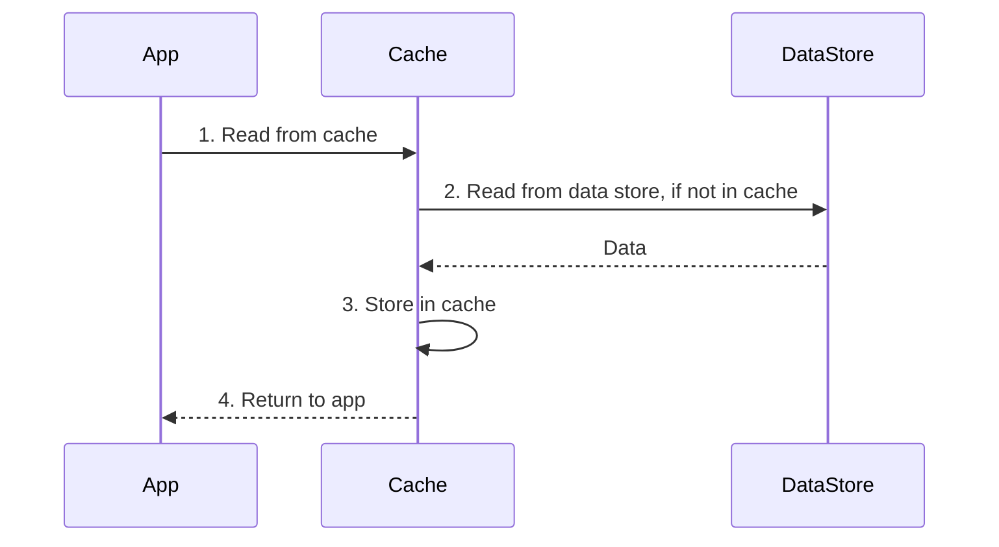
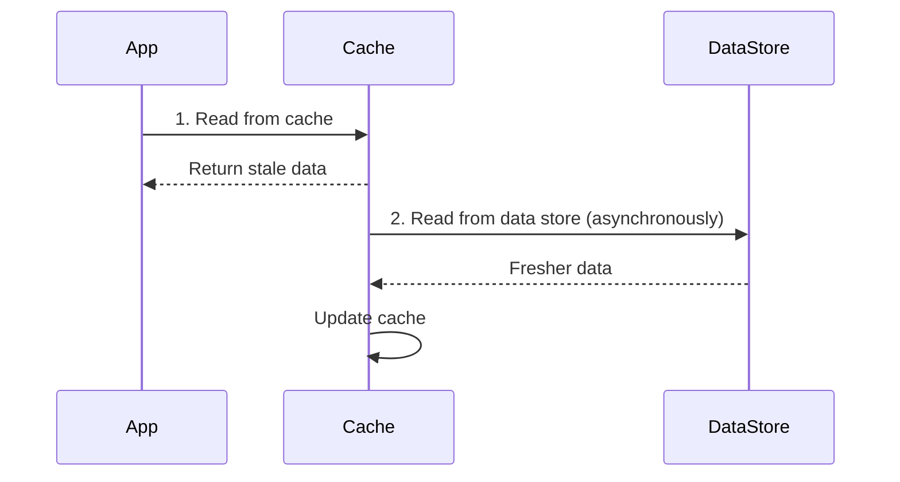
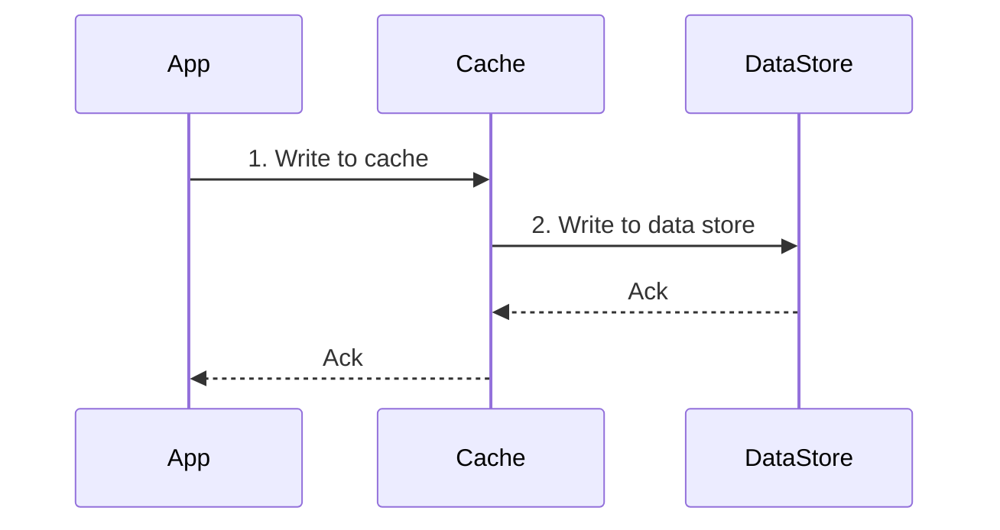
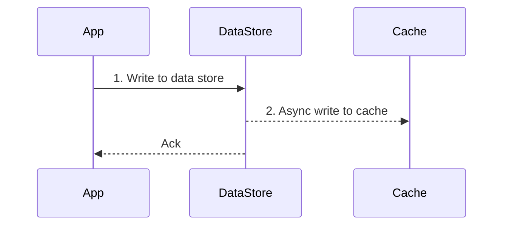
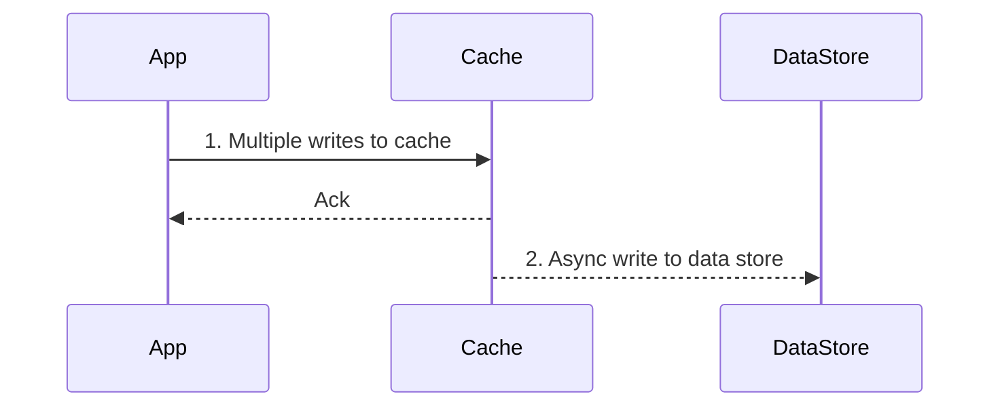

### Read-intensive application caching strategies

#### Cache-aside

#### Read-through

#### Refresh-ahead

### Write-intensive application caching strategies

#### Write-through

#### Write-around

#### Write-back

