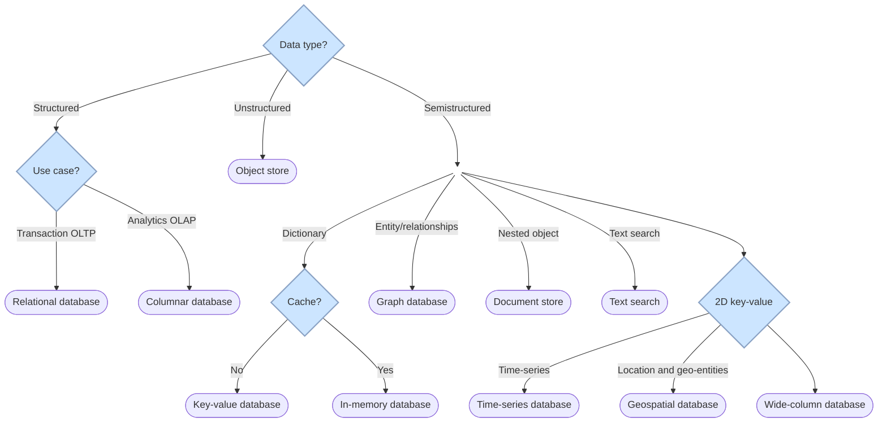

```mermaid
graph TD
    %% Define Node Shapes & Styles
    style DataType fill:#cce5ff,stroke:#8aa2c4,stroke-width:2px
    style UseCase fill:#cce5ff,stroke:#8aa2c4,stroke-width:2px
    style Cache fill:#cce5ff,stroke:#8aa2c4,stroke-width:2px
    style TwoDKeyValue fill:#cce5ff,stroke:#8aa2c4,stroke-width:2px
    
    %% Define Nodes
    DataType{Data type?}
    UseCase{Use case?}
    ObjectStore([Object store])
    RelationalDB([Relational database])
    ColumnarDB([Columnar database])
    
    %% Properly define the invisible node before linking from it
    InvisibleNode(( ))
    style InvisibleNode stroke:none,fill:none
    
    Cache{Cache?}
    KeyValueDB([Key-value database])
    InMemoryDB([In-memory database])
    GraphDB([Graph database])
    DocumentStore([Document store])
    TextSearch([Text search])
    TwoDKeyValue{2D key-value}
    TimeSeriesDB([Time-series database])
    WideColumnDB([Wide-column database])
    GeospatialDB([Geospatial database])

    %% Define Links
    DataType -- Structured --> UseCase
    DataType -- Unstructured --> ObjectStore
    DataType -- Semistructured --> InvisibleNode

    UseCase -- "Transaction OLTP" --> RelationalDB
    UseCase -- "Analytics OLAP" --> ColumnarDB

    InvisibleNode -- Dictionary --> Cache
    InvisibleNode -- "Entity/relationships" --> GraphDB
    InvisibleNode -- "Nested object" --> DocumentStore
    InvisibleNode -- "Text search" --> TextSearch
    InvisibleNode --> TwoDKeyValue

    Cache -- No --> KeyValueDB
    Cache -- Yes --> InMemoryDB
    
    TwoDKeyValue -- "Time-series" --> TimeSeriesDB
    TwoDKeyValue -- "Location and geo-entities" --> GeospatialDB
    TwoDKeyValue --> WideColumnDB
```
