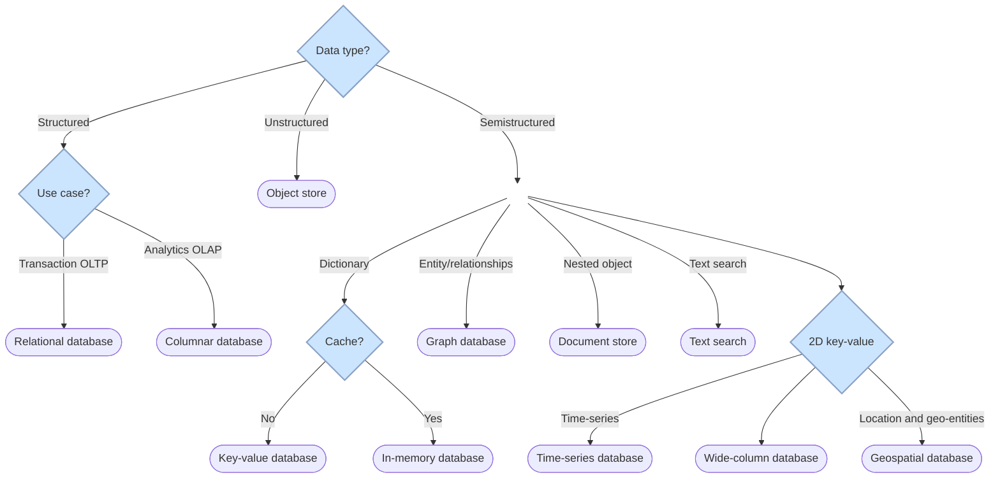

```mermaid
graph TD
    %% Define Node Shapes
    style DataType fill:#cce5ff,stroke:#8aa2c4,stroke-width:2px
    style UseCase fill:#cce5ff,stroke:#8aa2c4,stroke-width:2px
    style Cache fill:#cce5ff,stroke:#8aa2c4,stroke-width:2px
    style TwoDKeyValue fill:#cce5ff,stroke:#8aa2c4,stroke-width:2px
    
    %% Start Node
    DataType{Data type?}

    %% Top-Level Branches
    DataType -- Structured --> UseCase{Use case?}
    DataType -- Unstructured --> ObjectStore([Object store])
    
    %% Path for Structured Data
    UseCase -- Transaction OLTP --> RelationalDB([Relational database])
    UseCase -- Analytics OLAP --> ColumnarDB([Columnar database])

    %% Path for Semistructured Data
    %% An invisible node is used to help layout the multiple forks from the "Semistructured" path
    DataType -- Semistructured --> InvisibleNode( )
    style InvisibleNode stroke:none,fill:none

    InvisibleNode -- Dictionary --> Cache{Cache?}
    Cache -- No --> KeyValueDB([Key-value database])
    Cache -- Yes --> InMemoryDB([In-memory database])
    
    InvisibleNode -- Entity/relationships --> GraphDB([Graph database])
    InvisibleNode -- Nested object --> DocumentStore([Document store])
    InvisibleNode -- Text search --> TextSearch([Text search])
    InvisibleNode -- " " --> TwoDKeyValue{2D key-value}
    
    TwoDKeyValue -- Time-series --> TimeSeriesDB([Time-series database])
    TwoDKeyValue -- " " --> WideColumnDB([Wide-column database])
    TwoDKeyValue -- Location and geo-entities --> GeospatialDB([Geospatial database])
```
