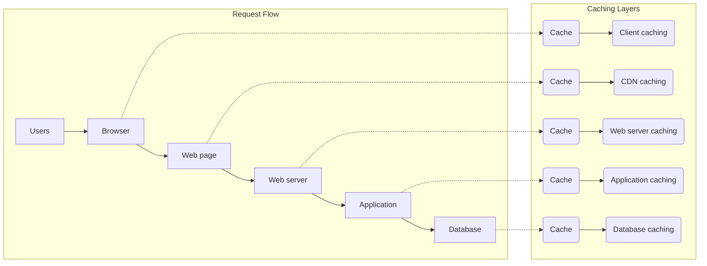

```mermaid
graph LR
    subgraph "Request Flow"
        Users --> Browser --> WebPage[Web page] --> WebServer[Web server] --> Application --> Database
    end

    subgraph "Caching Layers"
        direction TB
        C1(Cache) --> L1(Client caching)
        C2(Cache) --> L2(CDN caching)
        C3(Cache) --> L3(Web server caching)
        C4(Cache) --> L4(Application caching)
        C5(Cache) --> L5(Database caching)
    end

    Browser -.-> C1
    WebPage -.-> C2
    WebServer -.-> C3
    Application -.-> C4
    Database -.-> C5
```
