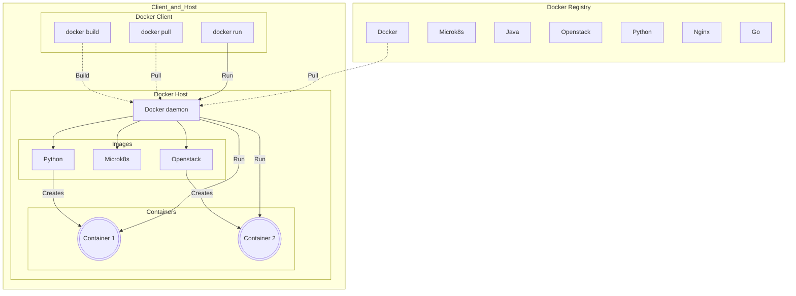

```mermaid
graph TD
    subgraph Client_and_Host
        subgraph Docker Client
            direction LR
            A["docker build"]
            B["docker pull"]
            C["docker run"]
        end

        subgraph Docker Host
            D["Docker daemon"]
            subgraph Images
                G["Python"]
                H["Microk8s"]
                I["Openstack"]
            end
            subgraph Containers
                E(((Container 1)))
                F(((Container 2)))
            end
        end
    end

    subgraph Docker Registry
        direction TB
        J["Docker"]
        K["Microk8s"]
        L["Java"]
        M["Openstack"]
        N["Python"]
        O["Nginx"]
        P["Go"]
    end

    %% Connections from Client to Host
    A -.->|Build| D
    B -.->|Pull| D
    C -->|Run| D

    %% Connections within Host
    D --> G
    D --> H
    D --> I
    G -->|Creates| E
    I -->|Creates| F
    D -->|Run| E
    D -->|Run| F

    %% Connection from Registry to Host
    J -.->|Pull| D
```
