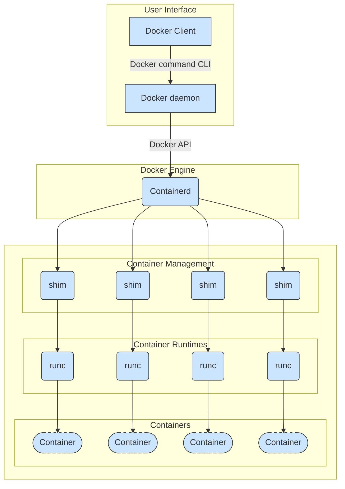

```mermaid
graph TD
    %% === 1. DECLARE ALL NODES AND SUBGRAPHS ===

    subgraph User Interface
        direction TB
        A["Docker Client"]
        B["Docker daemon"]
    end

    subgraph Docker Engine
        C("Containerd")
    end

    %% This invisible subgraph forces its children to be side-by-side
    subgraph " "
        direction LR

        subgraph "Container Management"
            direction TB
            D("shim")
            E("shim")
            F("shim")
            G("shim")
        end

        subgraph "Container Runtimes"
            direction TB
            H("runc")
            I("runc")
            J("runc")
            K("runc")
        end

        subgraph Containers
            direction TB
            L([Container])
            M([Container])
            N([Container])
            O([Container])
        end
    end


    %% === 2. DEFINE ALL LINKS BETWEEN NODES ===
    %% User commands flow from the client to the daemon, then to the engine.
    A -- "Docker command CLI" --> B
    B -- "Docker API" --> C

    %% Containerd manages the lifecycle for each container via a dedicated shim.
    C --> D
    C --> E
    C --> F
    C --> G

    %% Each shim process calls the low-level runtime to create the container.
    D --> H
    E --> I
    F --> J
    G --> K

    %% The runtime creates and runs the container process.
    H --> L
    I --> M
    J --> N
    K --> O


    %% === 3. APPLY STYLING ===
    classDef nodeStyle fill:#cce5ff,stroke:#333,stroke-width:1px;
    class A,B,C,D,E,F,G,H,I,J,K,L,M,N,O nodeStyle;

    %% Dashed style for container nodes to visually distinguish them.
    style L stroke-dasharray: 5 5;
    style M stroke-dasharray: 5 5;
    style N stroke-dasharray: 5 5;
    style O stroke-dasharray: 5 5;
```
