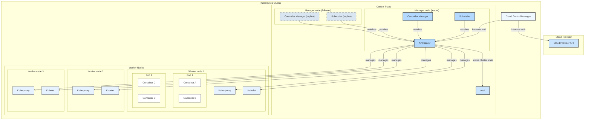

```mermaid
graph TD
    subgraph "Cloud Provider"
        CloudAPI["Cloud Provider API"]
    end

    subgraph "Kubernetes Cluster"
        direction LR
        subgraph "Control Plane"
            direction TB

            subgraph "Manager node (leader)"
                APIServer["API Server"]
                ControllerManager["Controller Manager"]
                Scheduler["Scheduler"]
            end

            subgraph "Manager node (follower)"
                direction TB
                FollowerControllerManager["Controller Manager (replica)"]
                FollowerScheduler["Scheduler (replica)"]
            end
            
            etcd["etcd"]

            APIServer -- "stores cluster state" --> etcd
            ControllerManager -- "watches" --> APIServer
            Scheduler -- "watches" --> APIServer
            
            FollowerControllerManager -- "watches" --> APIServer
            FollowerScheduler -- "watches" --> APIServer
            
        end

        subgraph "Worker Nodes"
            direction TB
            
            subgraph "Worker node 1"
                Kubelet1["Kubelet"]
                KubeProxy1["Kube-proxy"]
                
                subgraph "Pod 1"
                    ContainerA["Container A"]
                    ContainerB["Container B"]
                end

                subgraph "Pod 2"
                    ContainerC["Container C"]
                    ContainerD["Container D"]
                end
            end

            subgraph "Worker node 2"
                Kubelet2["Kubelet"]
                KubeProxy2["Kube-proxy"]
            end
            
            subgraph "Worker node 3"
                Kubelet3["Kubelet"]
                KubeProxy3["Kube-proxy"]
            end
            
        end
        
        CloudControlManager["Cloud Control Manager"]

        CloudControlManager -- "interacts with" --> CloudAPI
        CloudControlManager -- "interacts with" --> APIServer
        
        APIServer -- "manages" --> Kubelet1
        APIServer -- "manages" --> KubeProxy1
        APIServer -- "manages" --> Kubelet2
        APIServer -- "manages" --> KubeProxy2
        APIServer -- "manages" --> Kubelet3
        APIServer -- "manages" --> KubeProxy3
    end

    style CloudAPI fill:#cce5ff,stroke:#333,stroke-width:2px
    style etcd fill:#cce5ff,stroke:#333,stroke-width:2px
    style APIServer fill:#b3d9ff,stroke:#333,stroke-width:2px
    style ControllerManager fill:#b3d9ff,stroke:#333,stroke-width:2px
    style Scheduler fill:#b3d9ff,stroke:#333,stroke-width:2px
    style FollowerControllerManager fill:#d9e6f2,stroke:#333,stroke-width:1px,stroke-dasharray: 5 5
    style FollowerScheduler fill:#d9e6f2,stroke:#333,stroke-width:1px,stroke-dasharray: 5 5
    style Kubelet1 fill:#e6f2ff,stroke:#333,stroke-width:1px
    style KubeProxy1 fill:#e6f2ff,stroke:#333,stroke-width:1px
    style Kubelet2 fill:#e6f2ff,stroke:#333,stroke-width:1px
    style KubeProxy2 fill:#e6f2ff,stroke:#333,stroke-width:1px
    style Kubelet3 fill:#e6f2ff,stroke:#333,stroke-width:1px
    style KubeProxy3 fill:#e6f2ff,stroke:#333,stroke-width:1px
    style ContainerA fill:#ffffff,stroke:#333,stroke-width:1px
    style ContainerB fill:#ffffff,stroke:#333,stroke-width:1px
    style ContainerC fill:#ffffff,stroke:#333,stroke-width:1px
    style ContainerD fill:#ffffff,stroke:#333,stroke-width:1px
    style CloudControlManager fill:#f0f8ff,stroke:#333,stroke-width:2px
```
