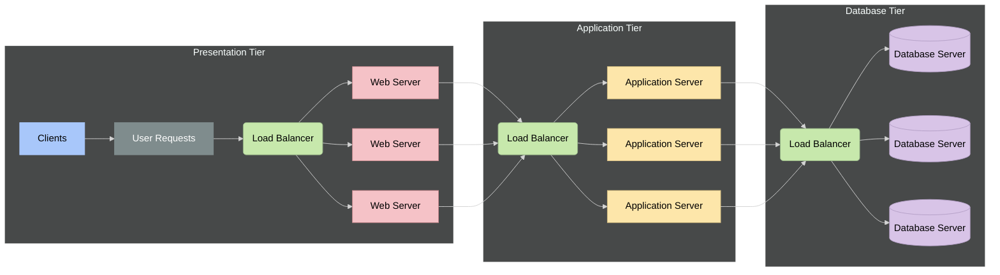

```mermaid
%%{init: {'theme': 'dark'}}%%
graph LR
    subgraph "Presentation Tier"
        Clients --> UR[User Requests] --> LB1(Load Balancer)
        LB1 --> WS1[Web Server]
        LB1 --> WS2[Web Server]
        LB1 --> WS3[Web Server]
    end

    subgraph "Application Tier"
        WS1 --> LB2(Load Balancer)
        WS2 --> LB2
        WS3 --> LB2
        LB2 --> AS1[Application Server]
        LB2 --> AS2[Application Server]
        LB2 --> AS3[Application Server]
    end

    subgraph "Database Tier"
        AS1 --> LB3(Load Balancer)
        AS2 --> LB3
        AS3 --> LB3
        LB3 --> DB1[(Database Server)]
        LB3 --> DB2[(Database Server)]
        LB3 --> DB3[(Database Server)]
    end

    %% Styling to closely match the target image
    style Clients fill:#a8c7fa,stroke:#a8c7fa,color:#000
    style UR fill:#7f8c8d,stroke:#7f8c8d,color:#fff
    style LB1 fill:#c7e8ac,stroke:#99b889,color:#000
    style LB2 fill:#c7e8ac,stroke:#99b889,color:#000
    style LB3 fill:#c7e8ac,stroke:#99b889,color:#000
    style WS1 fill:#f5c2c7,stroke:#d19096,color:#000
    style WS2 fill:#f5c2c7,stroke:#d19096,color:#000
    style WS3 fill:#f5c2c7,stroke:#d19096,color:#000
    style AS1 fill:#fde6aa,stroke:#e0c686,color:#000
    style AS2 fill:#fde6aa,stroke:#e0c686,color:#000
    style AS3 fill:#fde6aa,stroke:#e0c686,color:#000
    style DB1 fill:#d8c4e7,stroke:#b5a0c7,color:#000
    style DB2 fill:#d8c4e7,stroke:#b5a0c7,color:#000
    style DB3 fill:#d8c4e7,stroke:#b5a0c7,color:#000
```
