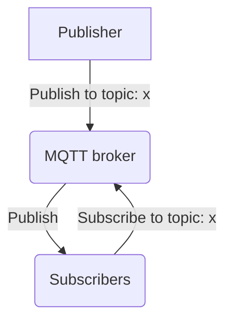
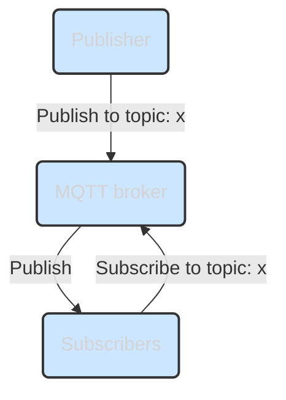

### MQTT

```mermaid
graph TD;
    A[Publisher] -->|Publish to topic: x| B(MQTT broker);
    B -->|Publish| C(Subscribers);
    C -->|Subscribe to topic: x| B;
```

```mermaid
graph TD;
    %% Define the style for the boxes
    classDef mqttStyle fill:#cce6ff,stroke:#333,stroke-width:2px,color:#d3d3d3;

    %% The diagram structure
    A(Publisher) -->|Publish to topic: x| B(MQTT broker);
    B -->|Publish| C(Subscribers);
    C -->|Subscribe to topic: x| B;

    %% Apply the style to all nodes
    class A,B,C mqttStyle;
```
