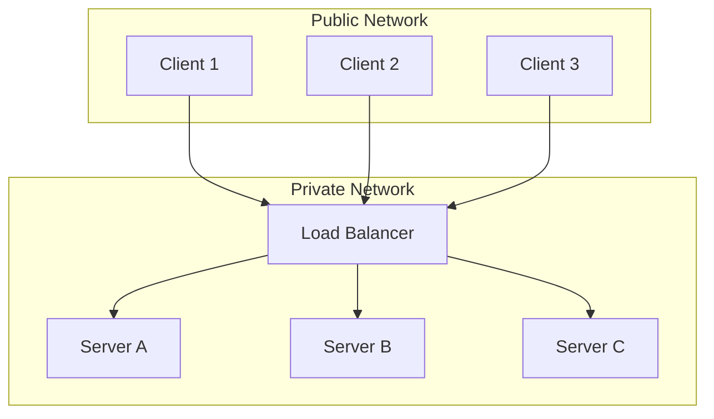
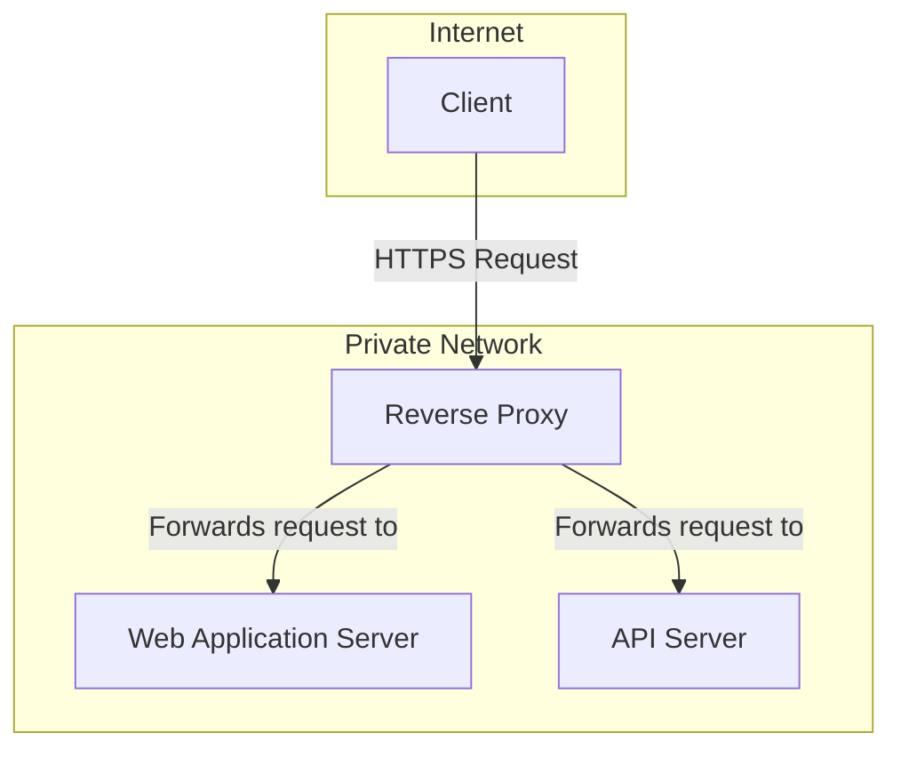
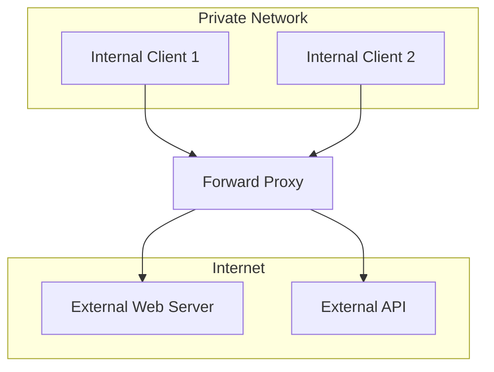
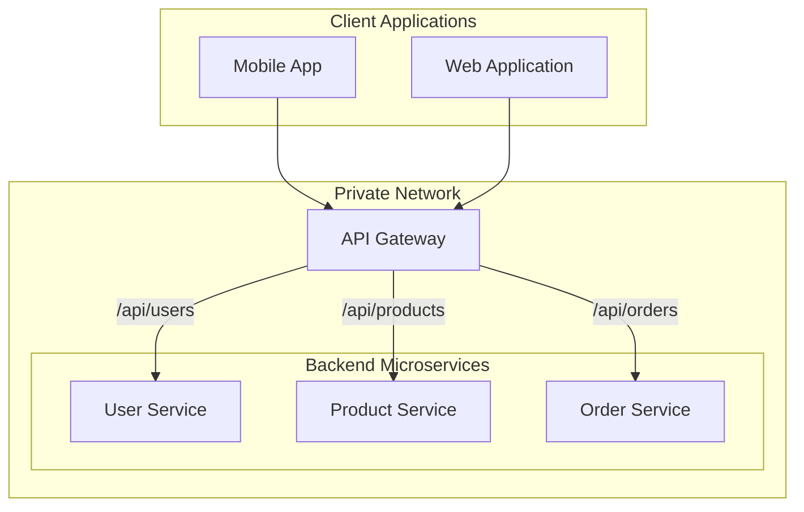

### Load Balancer

```mermaid
graph TD
    subgraph "Public Network"
        direction TB
        C1[Client 1]
        C2[Client 2]
        C3[Client 3]
    end

    subgraph "Private Network"
        direction TB
        LB[Load Balancer]
        S1[Server A]
        S2[Server B]
        S3[Server C]
        LB --> S1
        LB --> S2
        LB --> S3
    end

    C1 --> LB
    C2 --> LB
    C3 --> LB
```

### Reverse Proxy

```mermaid
graph TD
    subgraph "Internet"
        Client[Client]
    end

    subgraph "Private Network"
        RP[Reverse Proxy]
        WebApp[Web Application Server]
        APIServer[API Server]
    end

    Client -- HTTPS Request --> RP
    RP -- Forwards request to --> WebApp
    RP -- Forwards request to --> APIServer
```

### Forward Proxy

```mermaid
graph TD
    subgraph "Private Network"
        Client1[Internal Client 1]
        Client2[Internal Client 2]
    end

    FP[Forward Proxy]

    subgraph "Internet"
        WebServer[External Web Server]
        APIService[External API]
    end

    Client1 --> FP
    Client2 --> FP
    FP --> WebServer
    FP --> APIService
```

### API Gateway

```mermaid
graph TD
    subgraph "Client Applications"
        Mobile[Mobile App]
        WebApp[Web Application]
    end

    subgraph "Private Network"
        APIGateway[API Gateway]
        subgraph "Backend Microservices"
            Users[User Service]
            Products[Product Service]
            Orders[Order Service]
        end
    end

    Mobile --> APIGateway
    WebApp --> APIGateway

    APIGateway -- /api/users --> Users
    APIGateway -- /api/products --> Products
    APIGateway -- /api/orders --> Orders
```
