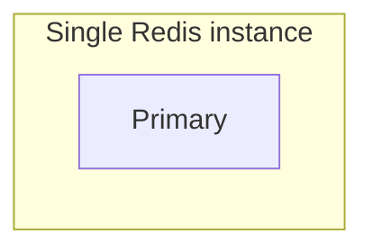
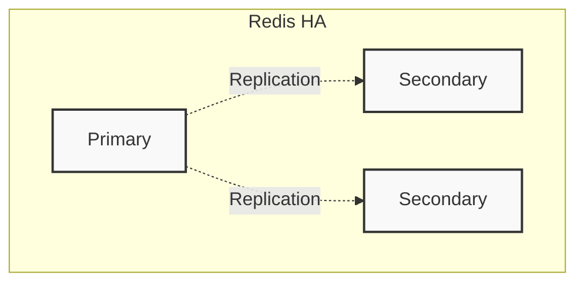
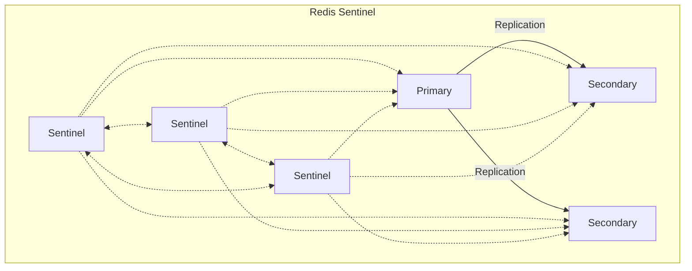
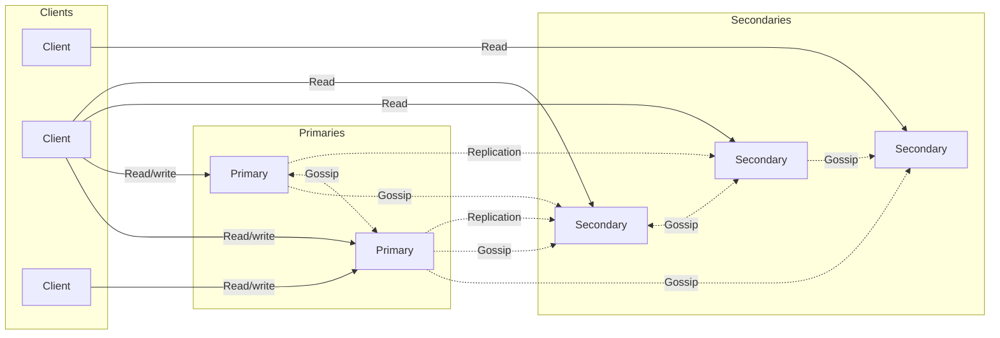

### Single Redis Instance

```mermaid
graph TD;
    subgraph "Single Redis instance";
        Primary;
    end
```

### Redis HA (High Availability)

```mermaid
graph TD;
    subgraph "Redis HA";
        Primary -. "Replication" .-> Secondary1[Secondary];
        Primary -. "Replication" .-> Secondary2[Secondary];
    end

    style Primary fill:#f9f9f9,stroke:#333,stroke-width:2px
    style Secondary1 fill:#f9f9f9,stroke:#333,stroke-width:2px
    style Secondary2 fill:#f9f9f9,stroke:#333,stroke-width:2px
```

### Redis Sentinel

```mermaid
graph TD;
    subgraph "Redis Sentinel";
        
        S1[Sentinel];
        S2[Sentinel];
        S3[Sentinel];
        P[Primary];
        SEC1[Secondary];
        SEC2[Secondary];

        %% Solid lines for Replication
        P -- "Replication" --> SEC1;
        P -- "Replication" --> SEC2;

        %% Dotted lines for Sentinel coordination
        S1 <-.-> S2;
        S2 <-.-> S3;
        S3 <-.-> S1;

        %% Dotted lines for Sentinel monitoring
        S1 -.-> P;
        S2 -.-> P;
        S3 -.-> P;
        S1 -.-> SEC1;
        S2 -.-> SEC1;
        S3 -.-> SEC1;
        S1 -.-> SEC2;
        S2 -.-> SEC2;
        S3 -.-> SEC2;
    end
```

### Redis Cluster

```mermaid
graph LR;
    subgraph Clients
        C1[Client];
        C2[Client];
        C3[Client];
    end

    subgraph Primaries
        P1[Primary];
        P2[Primary];
    end

    subgraph Secondaries
        S1[Secondary];
        S2[Secondary];
        S3[Secondary];
    end

    %% Client Connections
    C1 -- "Read" --> S3;
    C2 -- "Read" --> S1;
    C2 -- "Read" --> S2;
    C2 -- "Read/write" --> P1;
    C2 -- "Read/write" --> P2;
    C3 -- "Read/write" --> P2;


    %% Replication Links (dotted)
    P1 -. "Replication" .-> S2;
    P2 -. "Replication" .-> S1;

    %% Gossip Links (dotted)
    P1 <-. "Gossip" .-> P2;
    P1 -. "Gossip" .-> S1;
    P2 -. "Gossip" .-> S1;
    P2 -. "Gossip" .-> S3;
    S1 <-. "Gossip" .-> S2;
    S2 -. "Gossip" .-> S3;
```
