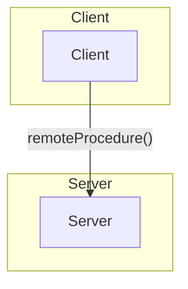
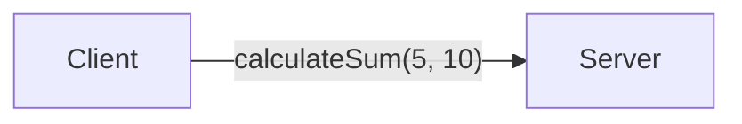
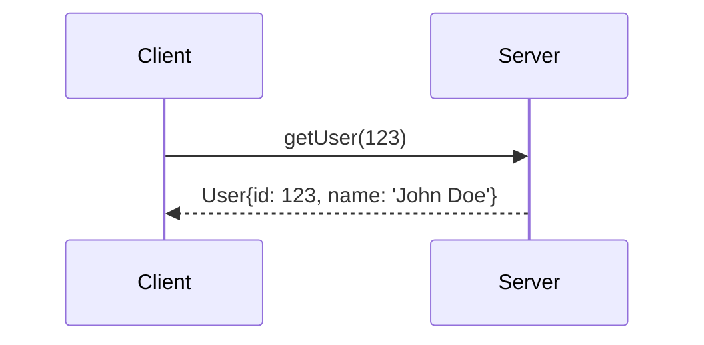
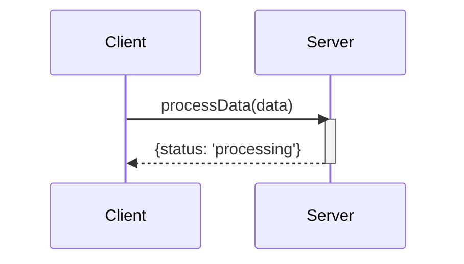

### Basic RPC Call

```mermaid
graph TD
    subgraph "Client"
        A[Client]
    end
    subgraph "Server"
        B[Server]
    end
    A -- remoteProcedure() --> B
```

### RPC with Parameters

```mermaid
graph LR
    Client -- calculateSum(5, 10) --> Server
```

### RPC with Return Value

```mermaid
sequenceDiagram
    participant Client
    participant Server
    Client->>Server: getUser(123)
    Server-->>Client: User{id: 123, name: 'John Doe'}
```

### Activating and Deactivating Participants

```mermaid
sequenceDiagram
    participant Client
    participant Server

    Client->>Server: processData(data)
    activate Server
    Server-->>Client: {status: 'processing'}
    deactivate Server
```
