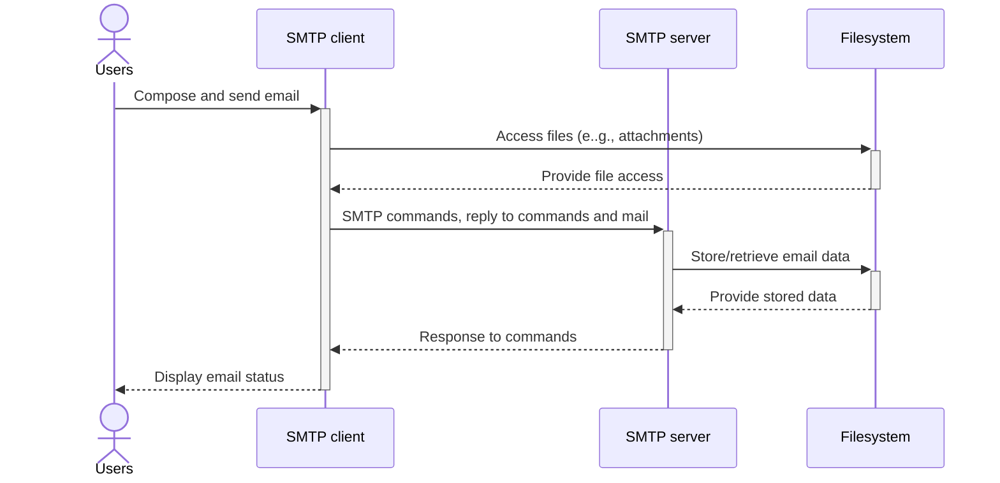

```mermaid
sequenceDiagram
    actor Users
    participant SMTP_Client as SMTP client
    participant SMTP_Server as SMTP server
    participant Filesystem

    # The user initiates the process, activating the SMTP client.
    Users->>+SMTP_Client: Compose and send email

    # The client accesses the filesystem for attachments; this is a brief, separate activation.
    SMTP_Client->>+Filesystem: Access files (e..g., attachments)
    Filesystem-->>-SMTP_Client: Provide file access

    # The client then communicates with the server, activating it.
    SMTP_Client->>+SMTP_Server: SMTP commands, reply to commands and mail

    # The server accesses the filesystem to store the email; another brief activation.
    SMTP_Server->>+Filesystem: Store/retrieve email data
    Filesystem-->>-SMTP_Server: Provide stored data

    # The server responds to the client and deactivates.
    SMTP_Server-->>-SMTP_Client: Response to commands

    # The client, having received the final response, updates the user and deactivates.
    SMTP_Client-->>-Users: Display email status
```
