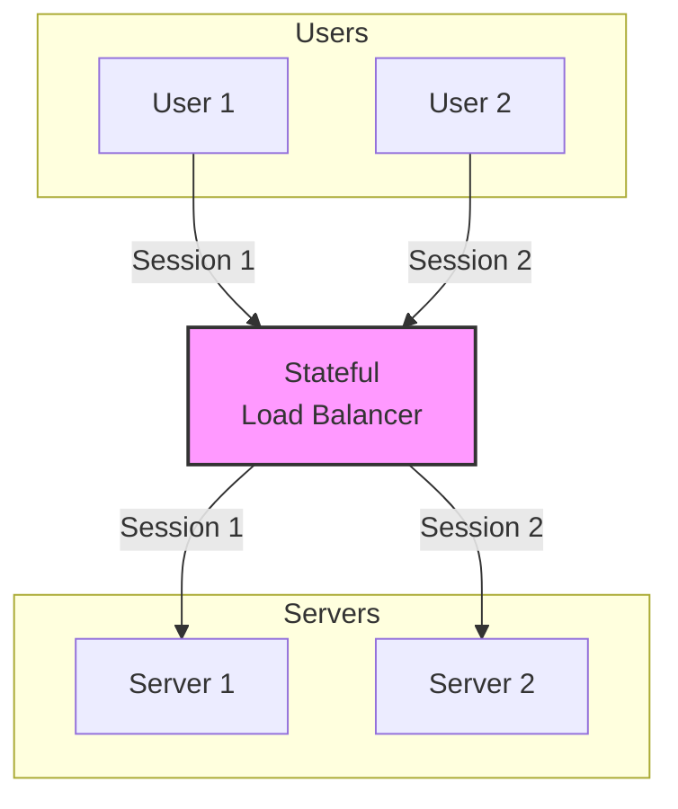
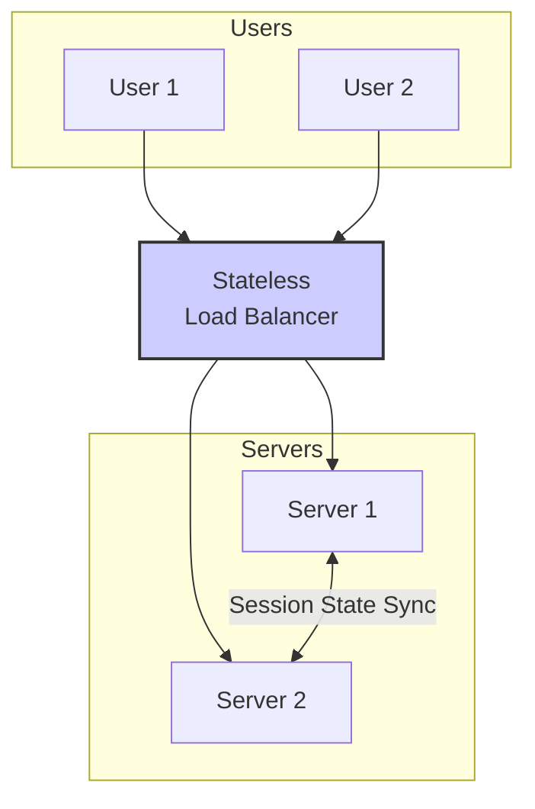

### Stateful Load Balancer

```mermaid
graph TD
    subgraph Users
        U1[User 1]
        U2[User 2]
    end

    subgraph Servers
        S1[Server 1]
        S2[Server 2]
    end

    LB[Stateful <br> Load Balancer]

    U1 -- Session 1 --> LB
    U2 -- Session 2 --> LB
    LB -- Session 1 --> S1
    LB -- Session 2 --> S2

    style LB fill:#f9f,stroke:#333,stroke-width:2px
```

### Stateless Load Balancer

```mermaid
graph TD
    subgraph Users
        U1[User 1]
        U2[User 2]
    end

    subgraph Servers
        S1[Server 1]
        S2[Server 2]
    end

    LB[Stateless <br> Load Balancer]

    U1 --> LB
    U2 --> LB
    LB --> S1
    LB --> S2

    S1 <-- "Session State Sync" --> S2

    style LB fill:#ccf,stroke:#333,stroke-width:2px
```
