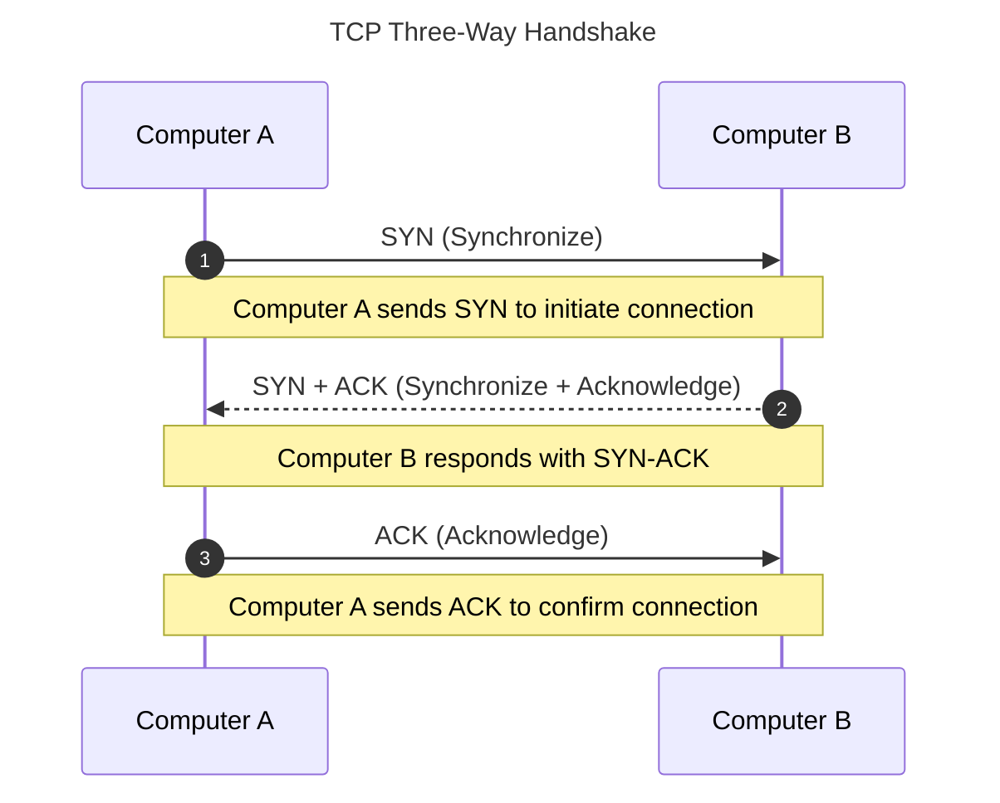

```mermaid
sequenceDiagram
    title: TCP Three-Way Handshake
    autonumber
    participant Computer A
    participant Computer B
    Computer A->>Computer B: SYN (Synchronize)
    Note over Computer A, Computer B: Computer A sends SYN to initiate connection
    Computer B-->>Computer A: SYN + ACK (Synchronize + Acknowledge)
    Note over Computer A, Computer B: Computer B responds with SYN-ACK
    Computer A->>Computer B: ACK (Acknowledge)
    Note over Computer A, Computer B: Computer A sends ACK to confirm connection
```
