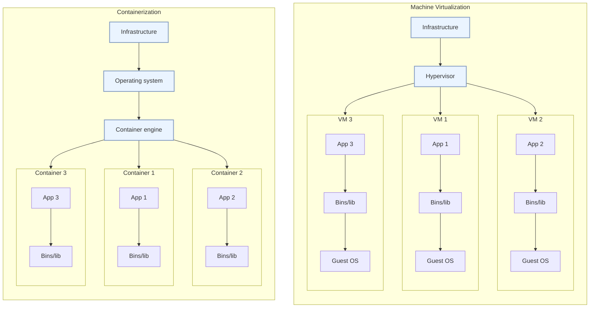

```mermaid
graph TD
    subgraph Machine Virtualization
        direction TB
        
        subgraph VM_1 [VM 1]
            direction TB
            App1[App 1] --> Bins1[Bins/lib] --> GuestOS1[Guest OS]
        end

        subgraph VM_2 [VM 2]
            direction TB
            App2[App 2] --> Bins2[Bins/lib] --> GuestOS2[Guest OS]
        end
        
        subgraph VM_3 [VM 3]
            direction TB
            App3[App 3] --> Bins3[Bins/lib] --> GuestOS3[Guest OS]
        end
        
        Hypervisor --> VM_1
        Hypervisor --> VM_2
        Hypervisor --> VM_3
        Infrastructure --> Hypervisor
    end

    subgraph Containerization
        direction TB

        subgraph Container_1 [Container 1]
            direction TB
            CApp1[App 1] --> CBins1[Bins/lib]
        end

        subgraph Container_2 [Container 2]
            direction TB
            CApp2[App 2] --> CBins2[Bins/lib]
        end

        subgraph Container_3 [Container 3]
            direction TB
            CApp3[App 3] --> CBins3[Bins/lib]
        end

        ContainerEngine[Container engine] --> Container_1
        ContainerEngine --> Container_2
        ContainerEngine --> Container_3
        OS[Operating system] --> ContainerEngine
        CInfrastructure[Infrastructure] --> OS
    end

%% Styling to better match the image
style Infrastructure fill:#eaf4ff,stroke:#849cc1,stroke-width:2px
style CInfrastructure fill:#eaf4ff,stroke:#849cc1,stroke-width:2px
style Hypervisor fill:#eaf4ff,stroke:#849cc1,stroke-width:2px
style OS fill:#eaf4ff,stroke:#849cc1,stroke-width:2px
style ContainerEngine fill:#eaf4ff,stroke:#849cc1,stroke-width:2px
```
