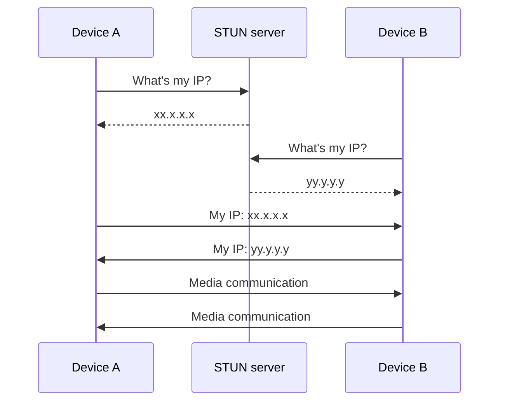

### WebRTC

```mermaid
sequenceDiagram
    participant Device A
    participant STUN server
    participant Device B

    Device A->>STUN server: What's my IP?
    STUN server-->>Device A: xx.x.x.x

    Device B->>STUN server: What's my IP?
    STUN server-->>Device B: yy.y.y.y

    Device A->>Device B: My IP: xx.x.x.x
    Device B->>Device A: My IP: yy.y.y.y

    Device A->>Device B: Media communication
    Device B->>Device A: Media communication
```
