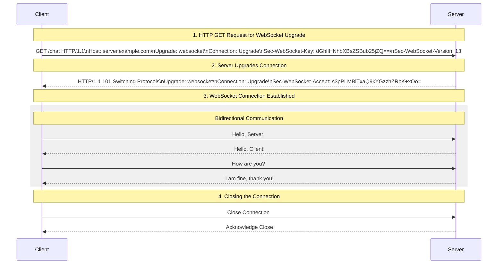
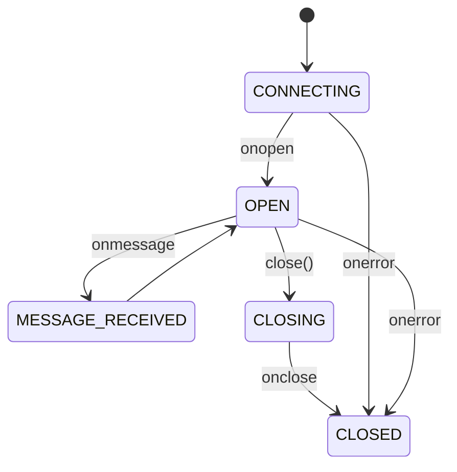
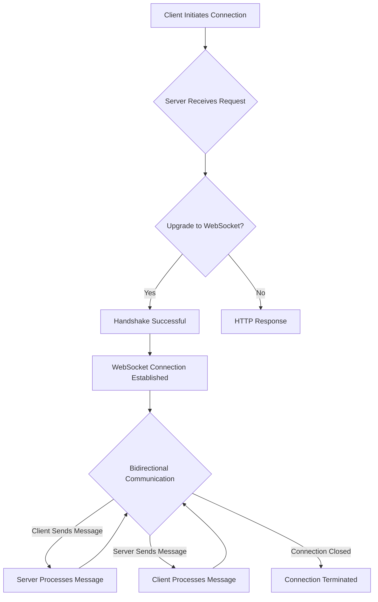

### WebSocket Handshake and Data Flow

```mermaid
sequenceDiagram
    participant Client
    participant Server

    Note over Client, Server: 1. HTTP GET Request for WebSocket Upgrade
    Client->>Server: GET /chat HTTP/1.1\nHost: server.example.com\nUpgrade: websocket\nConnection: Upgrade\nSec-WebSocket-Key: dGhlIHNhbXBsZSBub25jZQ==\nSec-WebSocket-Version: 13
    
    Note over Client, Server: 2. Server Upgrades Connection
    Server-->>Client: HTTP/1.1 101 Switching Protocols\nUpgrade: websocket\nConnection: Upgrade\nSec-WebSocket-Accept: s3pPLMBiTxaQ9kYGzzhZRbK+xOo=

    Note over Client, Server: 3. WebSocket Connection Established
    rect rgb(240, 240, 240)
        Note over Client, Server: Bidirectional Communication
        Client->>Server: Hello, Server!
        Server-->>Client: Hello, Client!
        Client->>Server: How are you?
        Server-->>Client: I am fine, thank you!
    end

    Note over Client, Server: 4. Closing the Connection
    Client->>Server: Close Connection
    Server-->>Client: Acknowledge Close
```

### WebSocket State Diagram

```mermaid
stateDiagram-v2
    [*] --> CONNECTING
    CONNECTING --> OPEN: onopen
    OPEN --> MESSAGE_RECEIVED: onmessage
    MESSAGE_RECEIVED --> OPEN
    OPEN --> CLOSING: close()
    CLOSING --> CLOSED: onclose
    CONNECTING --> CLOSED: onerror
    OPEN --> CLOSED: onerror
```

### WebSocket Connection Diagram

```mermaid
graph TD
    A[Client Initiates Connection] --> B{Server Receives Request};
    B --> C{Upgrade to WebSocket?};
    C -- Yes --> D[Handshake Successful];
    C -- No --> E[HTTP Response];
    D --> F[WebSocket Connection Established];
    F --> G{Bidirectional Communication};
    G -- Client Sends Message --> H[Server Processes Message];
    H --> G;
    G -- Server Sends Message --> I[Client Processes Message];
    I --> G;
    G -- Connection Closed --> J[Connection Terminated];
```
