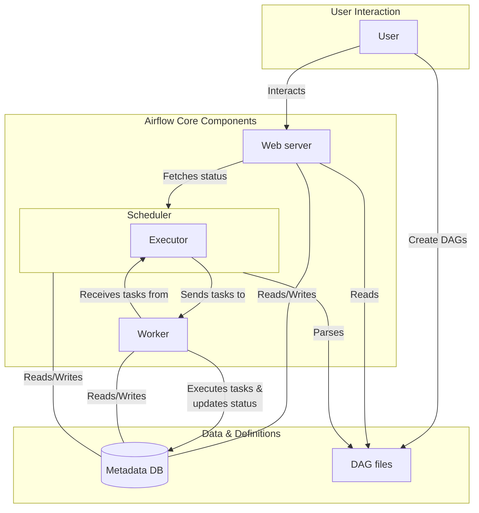

```mermaid
graph TD
    subgraph "User Interaction"
        U[User]
    end

    subgraph "Airflow Core Components"
        WS[Web server]
        subgraph Scheduler
            E[Executor]
        end
        W[Worker]
    end

    subgraph "Data & Definitions"
        MDB[(Metadata DB)]
        D[DAG files]
    end

    %% Defining connections and interactions
    U -- "Interacts" --> WS
    U -- "Create DAGs" --> D

    WS -- "Fetches status" --> Scheduler
    WS -- "Reads" --> D
    WS -- "Reads/Writes" --- MDB

    Scheduler -- "Parses" --> D
    Scheduler -- "Reads/Writes" --- MDB
    
    E -- "Sends tasks to" --> W
    W -- "Receives tasks from" --> E
    
    W -- "Executes tasks & <br> updates status" --> MDB
    %% This is the added line for full accuracy
    W -- "Reads/Writes" --- MDB
```
