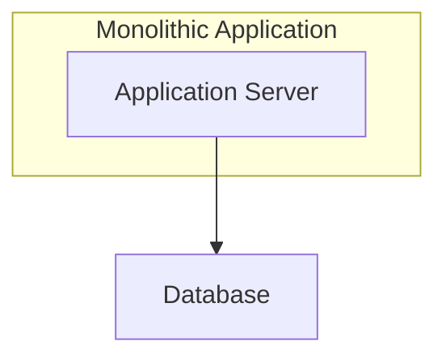
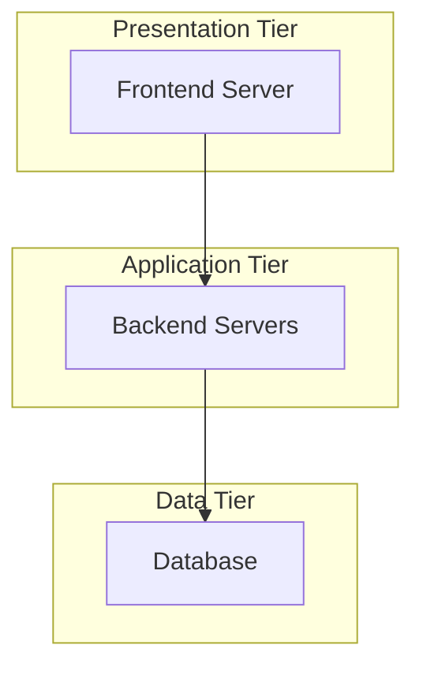
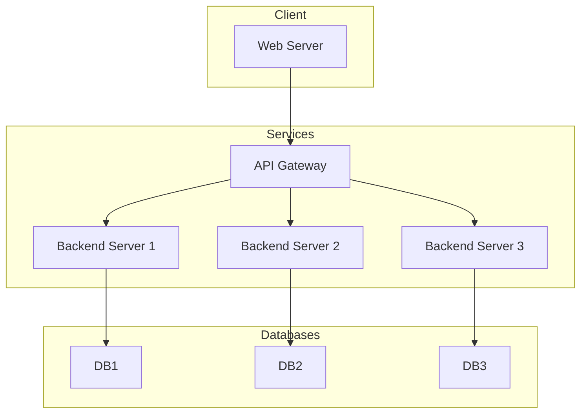

### Monolithic Architecture

```mermaid
graph TD
    subgraph Monolithic Application
        direction LR
        A[Application Server]
    end
    B[Database]
    A --> B
```

### N-Tier Architecture

```mermaid
graph TD
    subgraph Presentation Tier
        A[Frontend Server]
    end

    subgraph Application Tier
        B[Backend Servers]
    end

    subgraph Data Tier
        C[Database]
    end

    A --> B --> C
```

### Microservices Architecture

```mermaid
graph TD
    subgraph "Client"
        A[Web Server]
    end

    subgraph "Services"
        C[API Gateway]
        D[Backend Server 1]
        E[Backend Server 2]
        F[Backend Server 3]
    end

    subgraph "Databases"
        G[DB1]
        H[DB2]
        I[DB3]
    end

    A --> C
    C --> D
    C --> E
    C --> F
    D --> G
    E --> H
    F --> I
```
