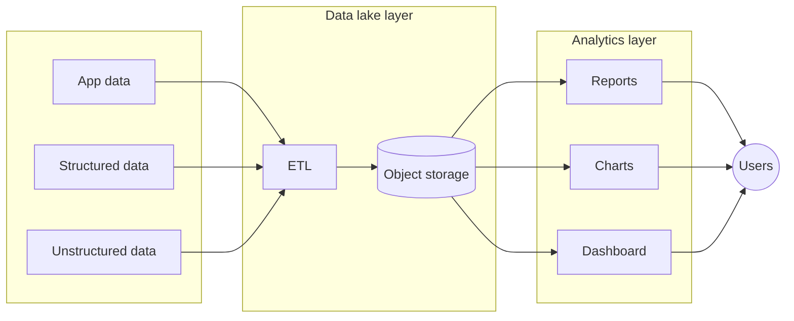

```mermaid
graph LR
    subgraph " "
        app_data["App data"]
        structured_data["Structured data"]
        unstructured_data["Unstructured data"]
    end

    subgraph "Data lake layer"
        etl["ETL"]
        storage[("Object storage")]
    end

    subgraph "Analytics layer"
        reports["Reports"]
        charts["Charts"]
        dashboard["Dashboard"]
    end

    users((Users))

    app_data --> etl
    structured_data --> etl
    unstructured_data --> etl

    etl --> storage

    storage --> reports
    storage --> charts
    storage --> dashboard

    reports --> users
    charts --> users
    dashboard --> users
```
