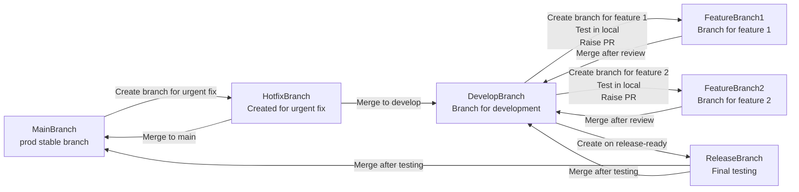

```mermaid
graph LR
    %% Core Branches
    MainBranch["MainBranch<br/>prod stable branch"]
    DevelopBranch["DevelopBranch<br/>Branch for development"]

    %% Feature Branches
    FeatureBranch1["FeatureBranch1<br/>Branch for feature 1"]
    FeatureBranch2["FeatureBranch2<br/>Branch for feature 2"]

    %% Release & Maintenance Branches
    ReleaseBranch["ReleaseBranch<br/>Final testing"]
    HotfixBranch["HotfixBranch<br/>Created for urgent fix"]

    %% --- Connections ---

    %% Feature workflow
    DevelopBranch -- "Create branch for feature 1<br/>Test in local<br/>Raise PR" --> FeatureBranch1
    FeatureBranch1 -- "Merge after review" --> DevelopBranch

    DevelopBranch -- "Create branch for feature 2<br/>Test in local<br/>Raise PR" --> FeatureBranch2
    FeatureBranch2 -- "Merge after review" --> DevelopBranch

    %% Release workflow
    DevelopBranch -- "Create on release-ready" --> ReleaseBranch
    ReleaseBranch -- "Merge after testing" --> MainBranch
    ReleaseBranch -- "Merge after testing" --> DevelopBranch

    %% Hotfix workflow
    MainBranch -- "Create branch for urgent fix" --> HotfixBranch
    HotfixBranch -- "Merge to main" --> MainBranch
    HotfixBranch -- "Merge to develop" --> DevelopBranch
```
