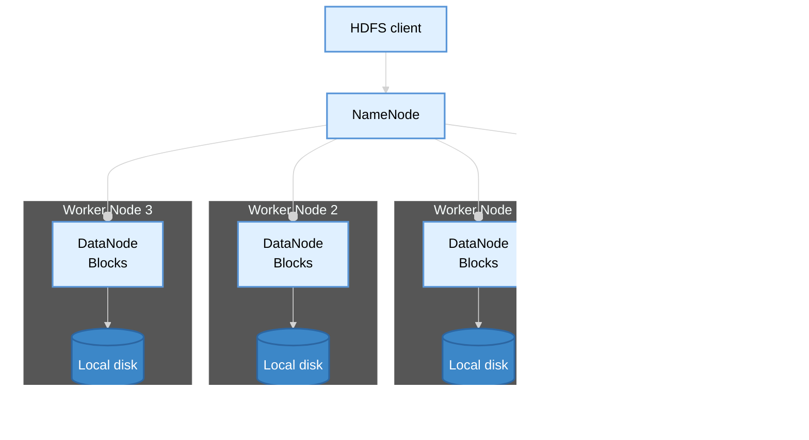

```mermaid
graph TD
    %% --- CONFIGURATION ---
    %% Set a theme that works well with custom styles
    %%{init: {'theme': 'dark', 'themeVariables': { 'mainBkg': '#2d2d2d'}}}%%

    %% --- STYLES ---
    classDef default fill:#e0f0ff,stroke:#5a96d8,stroke-width:2px,color:black,font-family:Arial
    classDef disk fill:#3c87c8,stroke:#2c66a2,stroke-width:2px,color:white,font-family:Arial
    classDef worker fill:#444,stroke:#888,stroke-width:1px,color:white

    %% --- NODES ---
    A[HDFS client]
    B[NameNode]
    C[Secondary NameNode]

    %% --- WORKER NODES (inside a parent subgraph for better layout) ---
    subgraph workers [ ]
        style workers fill:transparent,stroke:transparent

        subgraph Worker Node 1
            direction TB
            D1[DataNode <br> Blocks] --> L1[(Local disk)]
        end

        subgraph Worker Node 2
            direction TB
            D2[DataNode <br> Blocks] --> L2[(Local disk)]
        end

        subgraph Worker Node 3
            direction TB
            D3[DataNode <br> Blocks] --> L3[(Local disk)]
        end
    end


    %% --- RELATIONSHIPS ---
    A --> B
    B --> C
    B --o D1
    B --o D2
    B --o D3

    %% --- APPLY STYLES ---
    class D1,D2,D3 default
    class L1,L2,L3 disk
    class WorkerNode1,WorkerNode2,WorkerNode3 worker
```
