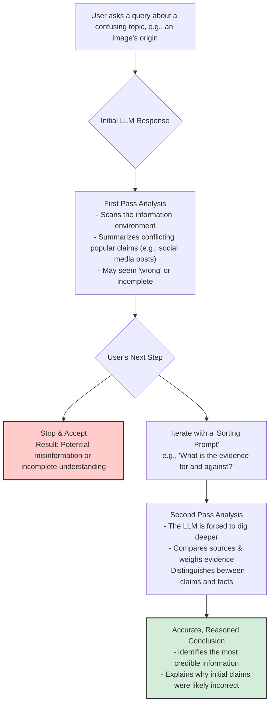

```mermaid
graph TD
    A[User asks a query about a confusing topic, e.g., an image's origin] --> B{Initial LLM Response};
    B --> C["First Pass Analysis<br/>- Scans the information environment<br/>- Summarizes conflicting popular claims (e.g., social media posts)<br/>- May seem 'wrong' or incomplete"];
    C --> D{User's Next Step};
    D --> E[Stop & Accept<br/>Result: Potential misinformation or incomplete understanding];
    D --> F[Iterate with a 'Sorting Prompt'<br/>e.g., 'What is the evidence for and against?'];
    F --> G["Second Pass Analysis<br/>- The LLM is forced to dig deeper<br/>- Compares sources & weighs evidence<br/>- Distinguishes between claims and facts"];
    G --> H["Accurate, Reasoned Conclusion<br/>- Identifies the most credible information<br/>- Explains why initial claims were likely incorrect"];

    style E fill:#ffcccb,stroke:#333,stroke-width:2px
    style H fill:#d4edda,stroke:#333,stroke-width:2px
```
