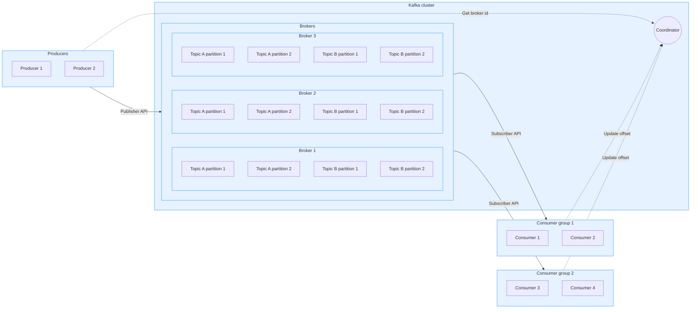

```mermaid
graph LR
    %% Styling for the main cluster box
    classDef cluster fill:#e6f2ff,stroke:#80bfff,stroke-width:2px

    %% Define Producers
    subgraph Producers
        Producer1[Producer 1]
        Producer2[Producer 2]
    end

    %% Define the Kafka Cluster
    subgraph Kafka_cluster [Kafka cluster]
        %% Create a dedicated subgraph for brokers to force LR direction
        subgraph Brokers
            direction LR
            subgraph Broker 1
                direction TB
                B1_TAPA1[Topic A partition 1]
                B1_TAPA2[Topic A partition 2]
                B1_TBPA1[Topic B partition 1]
                B1_TBPA2[Topic B partition 2]
            end

            subgraph Broker 2
                direction TB
                B2_TAPA1[Topic A partition 1]
                B2_TAPA2[Topic A partition 2]
                B2_TBPA1[Topic B partition 1]
                B2_TBPA2[Topic B partition 2]
            end

            subgraph Broker 3
                direction TB
                B3_TAPA1[Topic A partition 1]
                B3_TAPA2[Topic A partition 2]
                B3_TBPA1[Topic B partition 1]
                B3_TBPA2[Topic B partition 2]
            end
        end
        
        Coordinator((Coordinator))
    end
    class Kafka_cluster cluster

    %% Define Consumer Groups
    subgraph ConsumerGroup1 [Consumer group 1]
        Consumer1[Consumer 1]
        Consumer2[Consumer 2]
    end

    subgraph ConsumerGroup2 [Consumer group 2]
        Consumer3[Consumer 3]
        Consumer4[Consumer 4]
    end

    %% Define the primary data flow connections
    Producers -- Publisher API --> Brokers
    Brokers -- Subscriber API --> ConsumerGroup1
    Brokers -- Subscriber API --> ConsumerGroup2
    
    %% Define metadata/control connections
    Producers -.->|Get broker id| Coordinator
    ConsumerGroup1 -.->|Update offset| Coordinator
    ConsumerGroup2 -.->|Update offset| Coordinator
```
