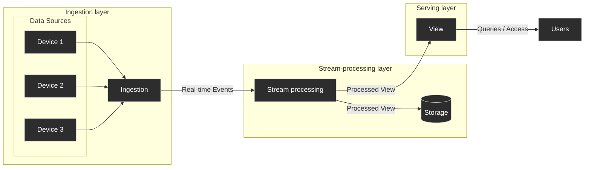

```mermaid
%% Refined Kappa Architecture Diagram
%% Direction: Left-to-Right Flow with specific link labels
graph LR

    %% 1. Ingestion Layer with nested Data Sources
    subgraph Ingestion layer
        direction LR
        subgraph Data Sources
            direction TB
            Device1[Device 1]
            Device2[Device 2]
            Device3[Device 3]
        end
        Ingestion
        Device1 --> Ingestion
        Device2 --> Ingestion
        Device3 --> Ingestion
    end

    %% 2. Stream-processing Layer
    subgraph Stream-processing layer
        direction LR
        StreamProcessor[Stream processing]
        Storage[(Storage)]
        StreamProcessor -- Processed View --> Storage
    end

    %% 3. Serving Layer
    subgraph Serving layer
        ServingView[View]
    end

    %% External Users
    Users

    %% Define the data flow between layers with specific labels
    Ingestion -- Real-time Events --> StreamProcessor
    StreamProcessor -- Processed View --> ServingView
    ServingView -- Queries / Access --> Users

    %% Optional: Styling for a dark theme look (closer to the image)
    classDef default fill:#2d2d2d,stroke:#ccc,color:#fff;
    classDef subgraphStyle fill:#3c3c3c,stroke:#aaa,color:#fff,stroke-width:1px;
    class Ingestion_layer,Stream-processing_layer,Serving_layer,Data_Sources subgraphStyle;
```
