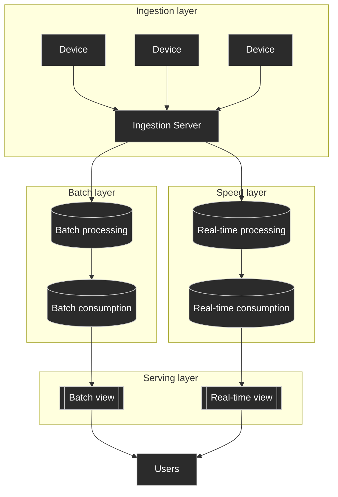

```mermaid
graph TD
    %% Define a top-to-bottom layout

    %% 1. Ingestion Layer
    subgraph Ingestion layer
        direction TB
        subgraph inner_ingestion [ ]
            direction LR
            D1[Device]
            D2[Device]
            D3[Device]
        end
        style inner_ingestion fill:none,stroke:none
        IS[Ingestion Server]
        D1 --> IS
        D2 --> IS
        D3 --> IS
    end

    %% Forking data into parallel layers
    subgraph Batch layer
        direction TB
        BP[(Batch processing)] --> BC[(Batch consumption)]
    end

    subgraph Speed layer
        direction TB
        RTP[(Real-time processing)] --> RTC[(Real-time consumption)]
    end

    %% Ingestion Server feeds both layers
    IS --> BP
    IS --> RTP

    %% 3. Serving Layer
    subgraph Serving layer
        BV[[Batch view]]
        RV[[Real-time view]]
    end

    %% Connecting processing layers to serving layer
    BC --> BV
    RTC --> RV

    %% 4. Users
    U[Users]

    %% Serving layer feeds the users
    BV --> U
    RV --> U

    %% Styling to better match the dark theme diagram
    %% (Note: Styling capabilities might depend on the Mermaid renderer)
    classDef default fill:#2b2b2b,stroke:#ccc,color:#fff
    classDef layer-title fill:#333,stroke:#ccc,color:#fff,font-weight:bold
```
