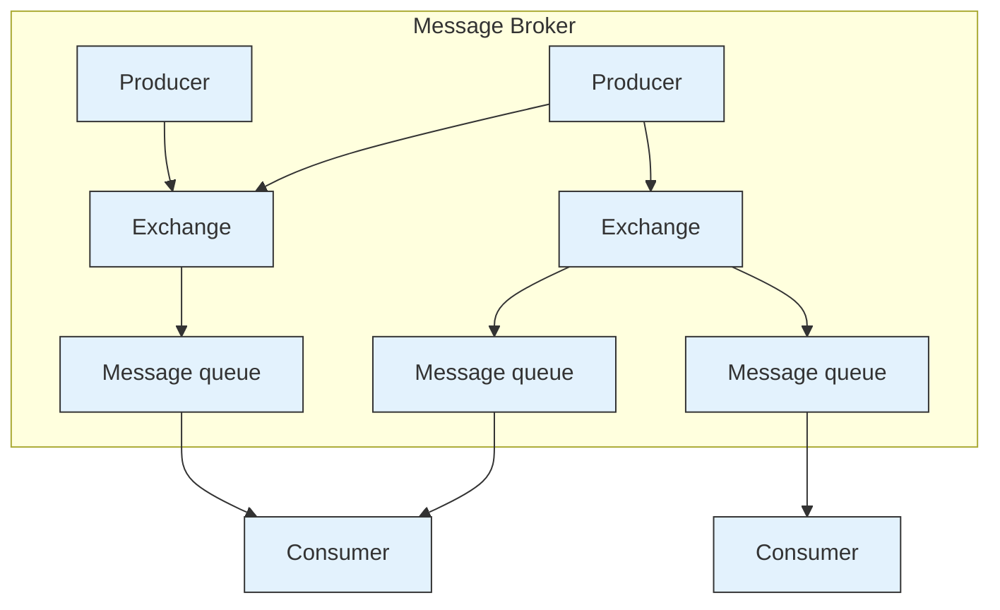

```mermaid
graph TD
    subgraph Message Broker
        P1[Producer] --> E1[Exchange]
        P2[Producer] --> E1
        P2 --> E2[Exchange]

        E1 --> Q1[Message queue]
        E2 --> Q2[Message queue]
        E2 --> Q3[Message queue]
    end

    Q1 --> C1[Consumer]
    Q2 --> C1
    Q3 --> C2[Consumer]

    %% Styling to match the visual appearance
    style P1 fill:#e3f2fd,stroke:#333
    style P2 fill:#e3f2fd,stroke:#333
    style E1 fill:#e3f2fd,stroke:#333
    style E2 fill:#e3f2fd,stroke:#333
    style Q1 fill:#e3f2fd,stroke:#333
    style Q2 fill:#e3f2fd,stroke:#333
    style Q3 fill:#e3f2fd,stroke:#333
    style C1 fill:#e3f2fd,stroke:#333
    style C2 fill:#e3f2fd,stroke:#333
```
