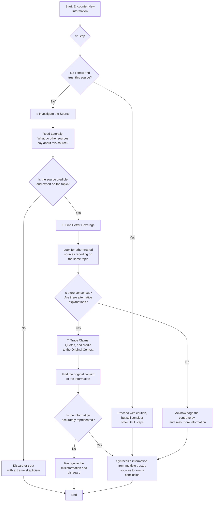

```mermaid
graph TD
    A[Start: Encounter New <br> Information] --> B{S: Stop};
    B --> C{Do I know and <br> trust this source?};
    C -- Yes --> D[Proceed with caution, <br> but still consider <br> other SIFT steps];
    C -- No --> E[I: Investigate the Source];
    E --> F[Read Laterally: <br> What do other sources <br> say about this source?];
    F --> G{Is the source credible <br> and expert on the topic?};
    G -- Yes --> H[F: Find Better Coverage];
    G -- No --> I[Discard or treat <br> with extreme skepticism];
    H --> J[Look for other trusted <br> sources reporting on <br> the same topic];
    J --> K{Is there consensus? <br> Are there alternative <br> explanations?};
    K -- Yes --> L[T: Trace Claims, <br> Quotes, and Media <br> to the Original Context];
    K -- No --> M[Acknowledge the controversy <br> and seek more information];
    L --> N[Find the original context <br> of the information];
    N --> O{Is the information <br> accurately represented?};
    O -- Yes --> P[Synthesize information <br> from multiple trusted <br> sources to form a conclusion];
    O -- No --> Q[Recognize the <br> misinformation and <br> disregard];
    D --> P;
    I --> R[End];
    M --> P;
    Q --> R;
    P --> R;
```
